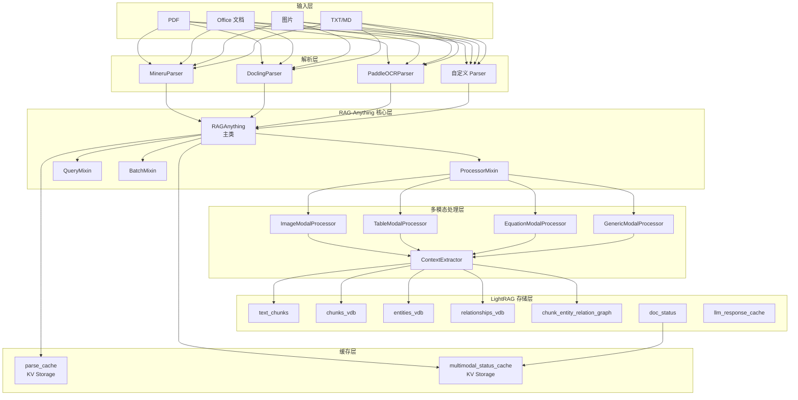
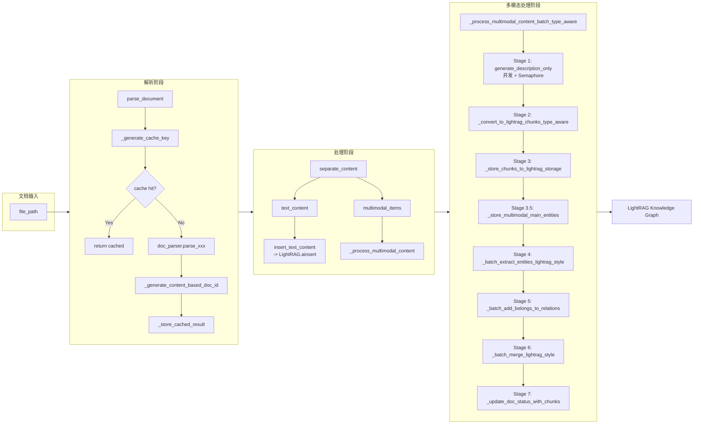

# RAG-Anything 源码分析文档

> **版本**: 1.3.1  
> **作者**: Zirui Guo  
> **仓库**: https://github.com/HKUDS/RAG-Anything  
> **分析日期**: 基于当前源码快照  
> **文档生成**: 源码分析员

---

## 目录

1. [项目概述](#1-项目概述)
2. [架构总览](#2-架构总览)
3. [核心类与接口](#3-核心类与接口)
4. [关键流程源码级解析](#4-关键流程源码级解析)
5. [设计亮点与工程细节](#5-设计亮点与工程细节)
6. [扩展机制](#6-扩展机制)
7. [依赖与部署](#7-依赖与部署)
8. [源码速查表](#8-源码速查表)

---

## 1. 项目概述

### 1.1 项目定位

**RAG-Anything** 是一个基于 **LightRAG** 的多模态 RAG（Retrieval-Augmented Generation）框架，定位是 "All-in-One Multimodal Document Processing RAG System"。它解决了传统文本 RAG 无法处理图像、表格、公式等非文本内容的痛点，将 PDF、Office 文档、图片中的文本、图像、表格、公式统一解析并插入到 LightRAG 的知识图谱中。

### 1.2 核心功能

| 功能维度 | 描述 |
|---------|------|
| **文档解析** | 支持 PDF、DOC/DOCX、PPT/PPTX、XLS/XLSX、TXT、MD、HTML、图片（PNG/JPG/BMP/TIFF/GIF/WebP） |
| **多模态处理** | 图像（ImageModalProcessor）、表格（TableModalProcessor）、公式（EquationModalProcessor）、通用（GenericModalProcessor） |
| **知识图谱插入** | 将文本 chunk 和多模态实体统一插入 LightRAG 的 KG、VDB、Chunk Storage |
| **查询增强** | 纯文本查询（aquery）、多模态查询（aquery_with_multimodal）、VLM 增强查询（aquery_vlm_enhanced） |
| **批量处理** | 文件夹级批量处理，支持并发控制 |
| **上下文感知** | 为每个多模态内容提取 page-based 或 chunk-based 上下文 |

### 1.3 技术栈

- **Python**: >= 3.10
- **核心依赖**: `lightrag-hku<1.5`, `mineru[core]`, `huggingface_hub`, `tqdm`
- **可选解析器**: `docling`（Office/HTML）、`paddleocr`（OCR）、`Pillow`（图像转换）、`reportlab`（文本转 PDF）
- **构建工具**: `setuptools>=64`, `wheel`

### 1.4 版本信息

```python
# repo/LLM-infrastructure/rag-anything/raganything/__init__.py
__version__ = "1.3.1"
__author__ = "Zirui Guo"
__url__ = "https://github.com/HKUDS/RAG-Anything"
```

### 1.5 与 LightRAG 的关系

RAG-Anything **不是 LightRAG 的 fork**，而是构建在 LightRAG 之上的**插件层/扩展层**：

- **LightRAG 负责**: 文本分块、实体关系提取、知识图谱构建、向量存储、查询检索、LLM 调用
- **RAG-Anything 负责**:
  - 文档解析（MinerU/Docling/PaddleOCR）
  - 文本与多模态内容分离
  - 多模态内容描述生成（调用 vision model / LLM）
  - 多模态实体 chunk 插入 LightRAG 存储
  - 查询时的多模态内容增强与 VLM 集成

RAG-Anything 通过 Mixin 模式（`QueryMixin`, `ProcessorMixin`, `BatchMixin`）扩展 LightRAG 的能力，同时保持与 LightRAG 存储层的兼容性。

---

## 2. 架构总览

### 2.1 系统架构图

<a name="architecture"></a>



### 2.2 核心模块划分

| 模块         | 文件路径                             | 职责                                                           |
| ---------- | -------------------------------- | ------------------------------------------------------------ |
| **包入口**    | `raganything/__init__.py`        | 版本信息、导出符号、可选模块的 try-import                                   |
| **状态枚举**   | `raganything/base.py`            | `DocStatus` 枚举定义                                             |
| **配置**     | `raganything/config.py`          | `RAGAnythingConfig` 配置类，支持环境变量                               |
| **主类**     | `raganything/raganything.py`     | `RAGAnything` 类，初始化、配置管理、LightRAG 集成                         |
| **处理**     | `raganything/processor.py`       | `ProcessorMixin`，文档解析、缓存、多模态处理、merge                         |
| **解析器**    | `raganything/parser.py`          | `Parser` 基类、`MineruParser`、`DoclingParser`、`PaddleOCRParser` |
| **多模态处理器** | `raganything/modalprocessors.py` | `BaseModalProcessor` 及子类、`ContextExtractor`/`ContextConfig`  |
| **查询**     | `raganything/query.py`           | `QueryMixin`，纯文本/多模态/VLM 增强查询                                |
| **批量**     | `raganything/batch.py`           | `BatchMixin`，文件夹批量处理、并发控制                                    |
| **工具**     | `raganything/utils.py`           | `separate_content`、`insert_text_content`、辅助函数                |
| **Prompt** | `raganything/prompt.py`          | `PromptRegistry`，所有多模态处理 prompt 模板                           |

### 2.3 数据流



---

## 3. 核心类与接口

### 3.1 `RAGAnything`（主类）

<a name="init"></a>
<a name="cleanup"></a>

**文件**: `repo/LLM-infrastructure/rag-anything/raganything/raganything.py`

**定义**:

```python
@dataclass
class RAGAnything(QueryMixin, ProcessorMixin, BatchMixin):
    """Multimodal Document Processing Pipeline"""
```

**继承关系**: `QueryMixin` -> `ProcessorMixin` -> `BatchMixin` -> `RAGAnything`

**核心字段**:

| 字段                        | 类型                            | 说明                             |
| ------------------------- | ----------------------------- | ------------------------------ |
| `lightrag`                | `Optional[LightRAG]`          | 预初始化的 LightRAG 实例（可选）          |
| `llm_model_func`          | `Optional[Callable]`          | LLM 模型函数                       |
| `vision_model_func`       | `Optional[Callable]`          | 视觉模型函数（用于图像分析）                 |
| `embedding_func`          | `Optional[Callable]`          | Embedding 函数                   |
| `config`                  | `Optional[RAGAnythingConfig]` | 配置对象                           |
| `lightrag_kwargs`         | `Dict[str, Any]`              | 传递给 LightRAG 构造器的额外参数          |
| `modal_processors`        | `Dict[str, Any]`              | 多模态处理器字典（`__post_init__` 后初始化） |
| `context_extractor`       | `Optional[ContextExtractor]`  | 上下文提取器                         |
| `parse_cache`             | `Optional[Any]`               | 解析结果缓存（LightRAG KV Storage）    |
| `multimodal_status_cache` | `Optional[Any]`               | 多模态处理状态兼容缓存                    |
| `callback_manager`        | `CallbackManager`             | 回调管理器（可选）                      |
|                           |                               |                                |

**初始化流程** (`__post_init__`):

```python
def __post_init__(self):
    if self.config is None:
        self.config = RAGAnythingConfig()
    self.working_dir = self.config.working_dir
    self.logger = logger  # 使用 LightRAG 的 logger
    self.doc_parser = get_parser(self.config.parser)  # 获取解析器
    atexit.register(self.close)  # 注册清理函数
    if not os.path.exists(self.working_dir):
        os.makedirs(self.working_dir)
```

**与 LightRAG 的集成方式** (`_ensure_lightrag_initialized`):

```python
async def _ensure_lightrag_initialized(self):
    # 1. 检查 parser 安装
    if not self._parser_installation_checked:
        if not self.doc_parser.check_installation():
            return {"success": False, "error": error_msg}
        self._parser_installation_checked = True

    if self.lightrag is not None:
        # 场景 A: 用户提供了预初始化的 LightRAG 实例
        # 继承 model functions
        if self.llm_model_func is None:
            self.llm_model_func = self.lightrag.llm_model_func
        if self.embedding_func is None:
            self.embedding_func = self.lightrag.embedding_func
        # 确保 storages 已初始化
        await self.lightrag.initialize_storages()
        # 初始化 parse_cache / multimodal_status_cache
        # 初始化 processors
        return {"success": True}
    else:
        # 场景 B: 创建新的 LightRAG 实例
        # 验证 llm_model_func 和 embedding_func 必须提供
        # 构造 LightRAG(**lightrag_params)
        # 初始化 storages、cache、processors
        return {"success": True}
```

RAG-Anything 对 LightRAG 的集成是**存储层级别的集成**：它直接使用 LightRAG 的 `text_chunks`、`chunks_vdb`、`entities_vdb`、`relationships_vdb`、`chunk_entity_relation_graph`、`doc_status`、`llm_response_cache` 等存储实例，而不是通过 API 调用。

### 3.2 `RAGAnythingConfig`

**文件**: `repo/LLM-infrastructure/rag-anything/raganything/config.py`

**定义**:

```python
@dataclass
class RAGAnythingConfig:
    """Configuration class for RAGAnything with environment variable support"""
```

**配置项**:

| 配置项                            | 环境变量                           | 默认值             | 类型        | 说明                           |
| ------------------------------ | ------------------------------ | --------------- | --------- | ---------------------------- |
| `working_dir`                  | `WORKING_DIR`                  | `./rag_storage` | str       | 工作目录                         |
| `parse_method`                 | `PARSE_METHOD`                 | `auto`          | str       | 解析方法：auto/txt/ocr            |
| `parser_output_dir`            | `OUTPUT_DIR`                   | `./output`      | str       | 解析输出目录                       |
| `parser`                       | `PARSER`                       | `mineru`        | str       | 解析器：mineru/docling/paddleocr |
| `display_content_stats`        | `DISPLAY_CONTENT_STATS`        | `True`          | bool      | 是否显示内容统计                     |
| `enable_image_processing`      | `ENABLE_IMAGE_PROCESSING`      | `True`          | bool      | 启用图像处理                       |
| `enable_table_processing`      | `ENABLE_TABLE_PROCESSING`      | `True`          | bool      | 启用表格处理                       |
| `enable_equation_processing`   | `ENABLE_EQUATION_PROCESSING`   | `True`          | bool      | 启用公式处理                       |
| `max_concurrent_files`         | `MAX_CONCURRENT_FILES`         | `1`             | int       | 最大并发文件数                      |
| `supported_file_extensions`    | `SUPPORTED_FILE_EXTENSIONS`    | `.pdf,.jpg,...` | List[str] | 支持的文件扩展名                     |
| `recursive_folder_processing`  | `RECURSIVE_FOLDER_PROCESSING`  | `True`          | bool      | 递归处理子文件夹                     |
| `context_window`               | `CONTEXT_WINDOW`               | `1`             | int       | 上下文窗口大小                      |
| `context_mode`                 | `CONTEXT_MODE`                 | `page`          | str       | 上下文模式：page/chunk             |
| `max_context_tokens`           | `MAX_CONTEXT_TOKENS`           | `2000`          | int       | 最大上下文 token 数                |
| `include_headers`              | `INCLUDE_HEADERS`              | `True`          | bool      | 包含标题                         |
| `include_captions`             | `INCLUDE_CAPTIONS`             | `True`          | bool      | 包含 caption                   |
| `context_filter_content_types` | `CONTEXT_FILTER_CONTENT_TYPES` | `text`          | List[str] | 上下文过滤内容类型                    |
| `content_format`               | `CONTENT_FORMAT`               | `minerU`        | str       | 内容格式                         |
| `use_full_path`                | `USE_FULL_PATH`                | `False`         | bool      | 使用完整路径                       |
|                                |                                |                 |           |                              |

**环境变量支持**:

```python
from lightrag.utils import get_env_value

working_dir: str = field(default=get_env_value("WORKING_DIR", "./rag_storage", str))
```

所有配置项都通过 `get_env_value` 从环境变量读取，支持默认值。同时有 **backward compatibility** 处理：`MINERU_PARSE_METHOD` 已弃用，会触发 `DeprecationWarning`。

### 3.3 `ProcessorMixin`

**文件**: `repo/LLM-infrastructure/rag-anything/raganything/processor.py`

**职责**: 文档解析->缓存->文本插入->多模态处理->实体关系提取->merge 的完整链路。

**核心方法**:

#### `parse_document`

```python
async def parse_document(self, file_path: str, output_dir=None, 
                         parse_method=None, display_stats=None, **kwargs) 
    -> tuple[List[Dict[str, Any]], str]:
```

- 根据文件扩展名选择解析方法（PDF -> `parse_pdf`，图片 -> `parse_image`，Office -> `parse_office_doc`）
- 使用 `asyncio.to_thread` 将同步解析器调用转为异步
- 生成 `cache_key`，检查 `parse_cache`
- 调用 `_generate_content_based_doc_id` 生成 doc_id
- 存储结果到 `parse_cache`

#### `process_document_complete`

完整文档处理工作流（见第4节详细解析）。

#### `_process_multimodal_content_batch_type_aware`

多模态内容的 type-aware 批处理（见第4节详细解析）。

### 3.4 `QueryMixin`

**文件**: `repo/LLM-infrastructure/rag-anything/raganything/query.py`

**职责**: 提供三种查询模式：

1. **`aquery`**: 纯文本查询，直接代理到 `LightRAG.aquery`
   - 支持 `vlm_enhanced` 参数：如果设置了 `vision_model_func`，自动切换到 VLM 增强查询

2. **`aquery_with_multimodal`**: 多模态查询
   - 接收 `multimodal_content` 列表（每个元素包含 `type` 和对应字段）
   - 对每个多模态内容调用对应的 processor 生成描述
   - 将描述拼接到查询中，再调用 `aquery`
   - 支持缓存（使用 `llm_response_cache`）

3. **`aquery_vlm_enhanced`**: VLM 增强查询
   - 先从 LightRAG 获取检索 prompt（`only_need_prompt=True`）
   - 从 prompt 中提取 image path（正则匹配 `Image Path: ...`）
   - 将图片路径转为 base64，构建 VLM message 格式
   - 调用 `vision_model_func` 进行多模态问答
   - 安全校验：只接受 `working_dir` 和 `parser_output_dir` 下的图片，防止 prompt injection

### 3.5 `BatchMixin`

**文件**: `repo/LLM-infrastructure/rag-anything/raganything/batch.py`

**职责**: 批量处理文档。

**核心方法**:

| 方法 | 说明 |
|------|------|
| `process_folder_complete` | 处理文件夹中所有支持文件，使用 `asyncio.Semaphore(max_workers)` 控制并发 |
| `process_documents_batch` | 使用 `BatchParser` 进行批量解析（仅解析，不插入 RAG） |
| `process_documents_batch_async` | 异步版本 |
| `process_documents_with_rag_batch` | 先批量解析，再对每个成功文件调用 `process_document_complete` |

`process_folder_complete` 的并发控制：

```python
semaphore = asyncio.Semaphore(max_workers)

async def process_single_file(file_path: Path):
    async with semaphore:
        await self.process_document_complete(str(file_path), ...)
```

### 3.6 `Parser` / `MineruParser` / `DoclingParser` / `PaddleOCRParser`

<a name="parser"></a>

**文件**: `repo/LLM-infrastructure/rag-anything/raganything/parser.py`

#### `Parser`（基类）

```python
class Parser:
    OFFICE_FORMATS = {".doc", ".docx", ".ppt", ".pptx", ".xls", ".xlsx"}
    IMAGE_FORMATS = {".png", ".jpeg", ".jpg", ".bmp", ".tiff", ".tif", ".gif", ".webp"}
    TEXT_FORMATS = {".txt", ".md"}
```

基类提供以下通用方法：
- `convert_office_to_pdf`: 使用 LibreOffice 将 Office 文档转为 PDF
- `convert_text_to_pdf`: 使用 ReportLab 将 TXT/MD 转为 PDF（支持中文 WenQuanYi 字体或 STSong-Light CID 字体）
- `_unique_output_dir`: 基于文件路径 MD5 哈希生成唯一输出子目录，防止同名文件冲突
- `_download_file`: 从 URL 下载文件到临时目录

#### `MineruParser`

MinerU 2.0 的解析器封装：

- **命令行调用**: `mineru -p <input> -o <output> -m <method>`
- **Windows 安全处理**: `_prepare_mineru_paths` 检测 Windows 不安全路径（非 ASCII、结尾空格/点），通过临时目录复制解决
- **输出读取**: `_read_output_files` 读取 `.md` 和 `_content_list.json`
- **字段兼容**: 自动处理 `img_caption` -> `image_caption`、`img_footnote` -> `image_footnote` 的别名
- **路径安全**: 解析图片路径时检查 `is_relative_to`，防止路径遍历攻击
- **进度监控**: 使用 threading + Queue 实时读取 stdout/stderr，支持 `timeout` 参数
- **格式转换**: 图片非 PNG/JPEG 时自动用 Pillow 转为 PNG（支持透明通道处理）

#### `DoclingParser`

Docling 的 Python API 封装（非 CLI 子进程）：

- **Converter 缓存**: `_converter_cache` 按 `(table_mode, do_tables, do_ocr, artifacts_path)` 缓存 `DocumentConverter` 实例，避免重复加载深度学习模型
- **并发安全**: 使用 `_converter_cache_lock` 保护缓存创建
- **直接导出**: `doc.export_to_dict()` 直接返回字典，无需磁盘 JSON 中转
- **递归解析**: `read_from_block_recursive` 遍历 Docling 的 JSON 引用结构（`$ref: #/body/0`）
- **图片提取**: 从 `block["image"]["uri"]` 提取 base64 数据并写入文件

#### `PaddleOCRParser`

PaddleOCR 的封装：

- **OCR 实例缓存**: `_ocr_instances` 按语言缓存 `PaddleOCR` 实例
- **多初始化策略**: 尝试 `{"lang": lang, "show_log": False}` -> `{"lang": lang}` -> `{}` 三级 fallback
- **PDF 渲染**: 使用 `pypdfium2` 将 PDF 每页渲染为图片，再调用 OCR
- **文本提取**: `_extract_text_lines` 递归遍历 PaddleOCR 返回的多层嵌套结构

### 3.7 `ContextExtractor` / `ContextConfig`

**文件**: `repo/LLM-infrastructure/rag-anything/raganything/modalprocessors.py`

#### `ContextConfig`

```python
@dataclass
class ContextConfig:
    context_window: int = 1           # 窗口大小
    context_mode: str = "page"        # "page" 或 "chunk"
    max_context_tokens: int = 2000    # 最大 token 数
    include_headers: bool = True      # 包含标题
    include_captions: bool = True     # 包含 caption
    filter_content_types: List[str] = None  # 过滤内容类型
```

#### `ContextExtractor`

<a name="context-modes"></a>

**上下文提取策略**：

1. **page-based** (`_extract_page_context`): 以 `page_idx` 为边界，提取 `current_page +/- context_window` 范围内的文本内容
2. **chunk-based** (`_extract_chunk_content`): 以 `content_list` 索引为边界，提取 `current_index +/- context_window` 范围内的文本内容

**截断策略** (`_truncate_context`):
- 使用 tokenizer 精确计算 token 数
- 截断后尝试在句子边界（`.`）或段落边界（`\n`）处结束
- 如果 tokenizer 不可用，回退到字符数截断

### 3.8 多模态处理器

**文件**: `repo/LLM-infrastructure/rag-anything/raganything/modalprocessors.py`

#### `BaseModalProcessor`

所有多模态处理器的基类，提供以下核心能力：

```python
class BaseModalProcessor:
    def __init__(self, lightrag, modal_caption_func, context_extractor=None):
        self.lightrag = lightrag
        self.modal_caption_func = modal_caption_func
        # 直接引用 LightRAG 的存储实例
        self.text_chunks_db = lightrag.text_chunks
        self.chunks_vdb = lightrag.chunks_vdb
        self.entities_vdb = lightrag.entities_vdb
        self.relationships_vdb = lightrag.relationships_vdb
        self.knowledge_graph_inst = lightrag.chunk_entity_relation_graph
        self.tokenizer = lightrag.tokenizer
```

**核心方法**:

| 方法 | 说明 |
|------|------|
| `generate_description_only` | Stage 1：生成描述和 entity_info，不提取实体关系 |
| `process_multimodal_content` | 完整处理：生成描述 -> 构建 chunk -> 创建 entity -> 存储到 LightRAG |
| `_create_entity_and_chunk` | 创建 chunk 和 entity，存储到 `text_chunks_db`、`chunks_vdb`、`entities_vdb`、`knowledge_graph_inst` |
| `_process_chunk_for_extraction` | 调用 LightRAG 的 `extract_entities` 和 `merge_nodes_and_edges` |
| `_robust_json_parse` | 4 层 JSON 解析 fallback |
| `_strip_thinking_tags` | 清理 reasoning model 的 thinking 标签 |

#### `ImageModalProcessor`

<a name="image-encoding"></a>

```python
class ImageModalProcessor(BaseModalProcessor):
```

- 将图片编码为 base64
- 调用 `vision_model_func`（或 fallback 到 `llm_model_func`）生成描述
- Prompt 模板: `vision_prompt` / `vision_prompt_with_context`
- 系统提示: `IMAGE_ANALYSIS_SYSTEM`

#### `TableModalProcessor`

- 提取 `table_body`（支持 list-of-lists 或字符串）
- 使用 `format_table_body` 将列表渲染为 Markdown 表格
- 调用 `llm_model_func` 生成分析
- Prompt 模板: `table_prompt` / `table_prompt_with_context`
- 系统提示: `TABLE_ANALYSIS_SYSTEM`

#### `EquationModalProcessor`

- 提取 equation 文本（优先 `text`，fallback `latex`/`equation`）
- 调用 `llm_model_func` 生成数学分析
- Prompt 模板: `equation_prompt` / `equation_prompt_with_context`
- 系统提示: `EQUATION_ANALYSIS_SYSTEM`

#### `GenericModalProcessor`

- 处理其他任意类型的多模态内容
- Prompt 模板: `generic_prompt` / `generic_prompt_with_context`

---

## 4. 关键流程源码级解析

### 4.1 `process_document_complete` -- 完整文档处理

<a name="core-flow"></a>

**文件**: `repo/LLM-infrastructure/rag-anything/raganything/processor.py` (行 1660-1824)

```python
async def process_document_complete(self, file_path, output_dir=None, 
                                    parse_method=None, display_stats=None, ...):
    """Complete document processing workflow"""
    callback_manager = getattr(self, "callback_manager", None)
    doc_start_time = time.time()
    stage = "parse"
    file_name = file_name or self._get_file_reference(file_path)

    try:
        # Step 0: 确保 LightRAG 已初始化
        init_result = await self._ensure_lightrag_initialized()
        if not init_result or not init_result.get("success"):
            raise RuntimeError(...)

        # Step 1: 解析文档 -> content_list + doc_id
        content_list, content_based_doc_id = await self.parse_document(
            file_path, output_dir, parse_method, display_stats, **kwargs
        )
        if doc_id is None:
            doc_id = content_based_doc_id

        # Step 2: 分离文本和多模态内容
        text_content, multimodal_items = separate_content(content_list)

        # Step 2.5: 为上下文提取设置内容源
        if hasattr(self, "set_content_source_for_context") and multimodal_items:
            self.set_content_source_for_context(content_list, self.config.content_format)

        # Step 3: 插入纯文本内容到 LightRAG
        stage = "text_insert"
        if text_content.strip():
            await insert_text_content(
                self.lightrag, input=text_content, file_paths=file_name,
                split_by_character=split_by_character, ... , ids=doc_id
            )
            await self._upsert_doc_status(doc_id, file_name, status=DocStatus.HANDLING)
        else:
            # 纯多模态文档：提前创建 doc_status
            await self._upsert_doc_status(doc_id, file_name, status=DocStatus.HANDLING)

        # Step 4: 处理多模态内容
        stage = "multimodal"
        if multimodal_items:
            await self._process_multimodal_content(multimodal_items, file_name, doc_id)
        else:
            await self._mark_multimodal_processing_complete(doc_id)

    except Exception as exc:
        # 错误处理：更新 doc_status 为 FAILED，触发 callback
        if doc_id is not None:
            await self._upsert_doc_status(doc_id, file_name, 
                                          status=DocStatus.FAILED, error_msg=str(exc))
        if callback_manager is not None:
            callback_manager.dispatch("on_document_error", ...)
        raise
```

**逐行解析**:

| 步骤 | 代码 | 说明 |
|------|------|------|
| 0 | `_ensure_lightrag_initialized()` | 检查 parser 安装，初始化 LightRAG、cache、processors |
| 1 | `parse_document()` | 带缓存的文档解析，返回 `content_list`（MinerU 格式）和 `doc_id` |
| 2 | `separate_content()` | 将 `content_list` 分为 `text_content`（字符串）和 `multimodal_items`（列表） |
| 2.5 | `set_content_source_for_context()` | 将原始 `content_list` 传给所有 modal processor，用于后续上下文提取 |
| 3 | `insert_text_content()` | 调用 `lightrag.ainsert()` 插入文本，LightRAG 会自动处理文本分块、实体提取、KG 构建 |
| 4 | `_process_multimodal_content()` | 处理多模态内容（见下节） |
| Error | `_upsert_doc_status(..., FAILED)` | 任何阶段出错都会将 doc_status 标记为 FAILED |

### 4.2 `_process_multimodal_content_batch_type_aware` -- 批量多模态处理

**文件**: `repo/LLM-infrastructure/rag-anything/raganything/processor.py` (行 884-1059)

这是 RAG-Anything 最核心的方法，实现了一个 **7 Stage Pipeline**:

```python
async def _process_multimodal_content_batch_type_aware(self, 
    multimodal_items, file_path, doc_id):

    # Stage 1: 并发生成描述（使用正确的 processor）
    semaphore = asyncio.Semaphore(getattr(self.lightrag, "max_parallel_insert", 2))
    
    async def process_single_item_with_correct_processor(item, index, file_path):
        async with semaphore:
            content_type = item.get("type", "unknown")
            processor = get_processor_for_type(self.modal_processors, content_type)
            (description, entity_info) = await processor.generate_description_only(
                modal_content=item, content_type=content_type, item_info=item_info
            )
            return {..., "description": description, "entity_info": entity_info, ...}
    
    tasks = [asyncio.create_task(process_single_item_with_correct_processor(...))]
    results = await asyncio.gather(*tasks, return_exceptions=True)

    # Stage 2: 转换为 LightRAG chunks 格式
    lightrag_chunks = self._convert_to_lightrag_chunks_type_aware(multimodal_data_list, file_path, doc_id)
    
    # Stage 3: 存储 chunks 到 LightRAG storage
    await self._store_chunks_to_lightrag_storage_type_aware(lightrag_chunks)
    
    # Stage 3.5: 存储 multimodal 主实体到 entities_vdb 和 full_entities
    await self._store_multimodal_main_entities(multimodal_data_list, lightrag_chunks, file_path, doc_id)
    
    # Stage 4: 批量提取实体关系
    chunk_results = await self._batch_extract_entities_lightrag_style_type_aware(lightrag_chunks)
    
    # Stage 5: 添加 belongs_to 关系
    enhanced_chunk_results = await self._batch_add_belongs_to_relations_type_aware(chunk_results, multimodal_data_list)
    
    # Stage 6: 批量 merge
    await self._batch_merge_lightrag_style_type_aware(enhanced_chunk_results, file_path, doc_id)
    
    # Stage 7: 更新 doc_status
    await self._update_doc_status_with_chunks_type_aware(doc_id, chunk_ids)
```

**Stage 1 详解**:

```python
semaphore = asyncio.Semaphore(getattr(self.lightrag, "max_parallel_insert", 2))
```

- 并发度从 LightRAG 的 `max_parallel_insert` 读取，默认 2
- 每个 item 使用 `get_processor_for_type` 选择正确的 processor（image/table/equation/generic）
- 调用 `processor.generate_description_only()` 生成 `description` 和 `entity_info`
- 进度追踪：`progress_lock` + `completed_count`，每 10% 输出日志

**Stage 2 详解** (`_convert_to_lightrag_chunks_type_aware`):

```python
def _convert_to_lightrag_chunks_type_aware(self, multimodal_data_list, file_path, doc_id):
    chunks = {}
    for data in multimodal_data_list:
        description = data["description"]
        entity_info = data["entity_info"]
        content_type = data["content_type"]
        original_item = data["original_item"]

        # 根据内容类型应用 chunk 模板
        formatted_chunk_content = self._apply_chunk_template(content_type, original_item, description)
        chunk_id = compute_mdhash_id(formatted_chunk_content, prefix="chunk-")
        tokens = len(self.lightrag.tokenizer.encode(formatted_chunk_content))

        chunks[chunk_id] = {
            "content": formatted_chunk_content,
            "tokens": tokens,
            "full_doc_id": doc_id,
            "chunk_order_index": chunk_order_index,
            "file_path": file_ref,
            "llm_cache_list": [],
            "is_multimodal": True,
            "modal_entity_name": entity_info["entity_name"],
            "original_type": data["content_type"],
            "page_idx": data["item_info"].get("page_idx", 0),
        }
```

- 使用 `_apply_chunk_template` 根据内容类型选择模板（`image_chunk`/`table_chunk`/`equation_chunk`/`generic_chunk`）
- 使用 `compute_mdhash_id` 生成 chunk_id
- chunk 包含 `is_multimodal=True` 标记，便于后续识别

**Stage 5 详解** (`_batch_add_belongs_to_relations_type_aware`):

```python
async def _batch_add_belongs_to_relations_type_aware(self, chunk_results, multimodal_data_list):
    for maybe_nodes, maybe_edges in chunk_results:
        for entity_name in maybe_nodes.keys():
            if entity_name != modal_entity_name:  # 避免自关系
                belongs_to_relation = {
                    "src_id": entity_name,
                    "tgt_id": modal_entity_name,
                    "description": f"Entity {entity_name} belongs to {modal_entity_name}",
                    "keywords": "belongs_to,part_of,contained_in",
                    "source_id": chunk_id,
                    "weight": 10.0,
                    "file_path": file_path,
                }
                maybe_edges[edge_key] = [belongs_to_relation]
```

- 为每个从 chunk 中提取的实体添加 `belongs_to` 关系，指向该多模态内容的主实体
- `weight = 10.0` 表示高权重，确保知识图谱中的归属关系显著

### 4.3 `_ensure_lightrag_initialized` -- LightRAG 初始化与模型函数继承

**文件**: `repo/LLM-infrastructure/rag-anything/raganything/raganything.py` (行 258-420)

```python
async def _ensure_lightrag_initialized(self):
    # 1. 检查 parser 安装
    if not self._parser_installation_checked:
        if not self.doc_parser.check_installation():
            return {"success": False, "error": error_msg}
        self._parser_installation_checked = True

    if self.lightrag is not None:
        # 场景 A: 预提供的 LightRAG 实例
        # 1. 继承 model functions
        if self.llm_model_func is None and hasattr(self.lightrag, "llm_model_func"):
            self.llm_model_func = self.lightrag.llm_model_func
        if self.embedding_func is None and hasattr(self.lightrag, "embedding_func"):
            self.embedding_func = self.lightrag.embedding_func
        
        # 2. 确保 storages 已初始化
        if (not hasattr(self.lightrag, "_storages_status") 
            or self.lightrag._storages_status.name != "INITIALIZED"):
            await self.lightrag.initialize_storages()
            await initialize_pipeline_status()
        
        # 3. 初始化 parse_cache（使用 LightRAG 的 KV storage 类）
        if self.parse_cache is None:
            self.parse_cache = self.lightrag.key_string_value_json_storage_cls(
                namespace="parse_cache", workspace=self.lightrag.workspace, ...
            )
            await self.parse_cache.initialize()
        
        # 4. 初始化 multimodal_status_cache
        if self.multimodal_status_cache is None:
            self.multimodal_status_cache = self.lightrag.key_string_value_json_storage_cls(
                namespace="multimodal_status", ...
            )
            await self.multimodal_status_cache.initialize()
        
        # 5. 初始化 processors
        if not self.modal_processors:
            self._initialize_processors()
        
        return {"success": True}
    
    else:
        # 场景 B: 创建新 LightRAG 实例
        # 验证 llm_model_func 和 embedding_func 必须提供
        if self.llm_model_func is None:
            return {"success": False, "error": "llm_model_func must be provided"}
        if self.embedding_func is None:
            return {"success": False, "error": "embedding_func must be provided"}
        
        # 构造参数
        lightrag_params = {
            "working_dir": self.working_dir,
            "llm_model_func": self.llm_model_func,
            "embedding_func": self.embedding_func,
        }
        lightrag_params.update(self.lightrag_kwargs)  # 用户自定义参数覆盖
        
        # 创建 LightRAG
        self.lightrag = LightRAG(**lightrag_params)
        await self.lightrag.initialize_storages()
        await initialize_pipeline_status()
        
        # 初始化 caches 和 processors
        ...
        return {"success": True}
```

**关键设计**:
- 支持两种使用模式：预提供 LightRAG 实例 或 由 RAG-Anything 创建
- 预提供模式下自动继承 `llm_model_func` 和 `embedding_func`
- `parse_cache` 和 `multimodal_status_cache` 使用 LightRAG 的 `key_string_value_json_storage_cls`，确保与 LightRAG 存储层一致
- 所有错误都返回 `{"success": False, "error": ...}` 而不是抛出异常，便于上层处理

### 4.4 `parse_document` -- 带缓存的文档解析

**文件**: `repo/LLM-infrastructure/rag-anything/raganything/processor.py` (行 388-607)

```python
async def parse_document(self, file_path, output_dir=None, 
                         parse_method=None, display_stats=None, **kwargs):
    # 1. 使用 config 默认值
    if output_dir is None: output_dir = self.config.parser_output_dir
    if parse_method is None: parse_method = self.config.parse_method
    if display_stats is None: display_stats = self.config.display_content_stats

    # 2. 生成 cache_key（基于文件 mtime + 解析配置）
    cache_key = self._generate_cache_key(file_path, parse_method, **kwargs)
    
    # 3. 检查缓存
    cached_result = await self._get_cached_result(cache_key, file_path, parse_method, **kwargs)
    if cached_result is not None:
        return cached_result  # (content_list, doc_id)

    # 4. 根据扩展名选择解析方法
    ext = file_path.suffix.lower()
    if ext in [".pdf"]:
        content_list = await asyncio.to_thread(doc_parser.parse_pdf, ...)
    elif ext in [".jpg", ".jpeg", ...]:
        content_list = await asyncio.to_thread(doc_parser.parse_image, ...)
    elif ext in [".doc", ".docx", ...]:
        content_list = await asyncio.to_thread(doc_parser.parse_office_doc, ...)
    else:
        content_list = await asyncio.to_thread(doc_parser.parse_document, ...)

    # 5. 生成基于内容的 doc_id
    doc_id = self._generate_content_based_doc_id(content_list)
    
    # 6. 存储到缓存
    await self._store_cached_result(cache_key, content_list, doc_id, file_path, parse_method, **kwargs)
    
    return content_list, doc_id
```

**缓存策略** (`_generate_cache_key`):

```python
def _generate_cache_key(self, file_path, parse_method=None, **kwargs):
    mtime = file_path.stat().st_mtime  # 文件修改时间
    config_dict = {
        "file_path": str(file_path.absolute()),
        "mtime": mtime,
        "parser": self.config.parser,
        "parse_method": parse_method or self.config.parse_method,
    }
    # 只包含影响解析结果的相关参数
    relevant_kwargs = {k: v for k, v in kwargs.items() 
                       if k in ["lang", "device", "start_page", "end_page", 
                                "formula", "table", "backend", "source"]}
    config_dict.update(relevant_kwargs)
    config_str = json.dumps(config_dict, sort_keys=True)
    cache_key = hashlib.md5(config_str.encode()).hexdigest()
    return cache_key
```

- 缓存 key 基于 **文件路径 + mtime + 解析器 + 解析方法 + 相关参数** 的 MD5 哈希
- 缓存校验时检查 `current_mtime != cached_mtime`，文件修改后自动失效
- 缓存校验时检查 `cached_config != current_config`，配置变更后自动失效

### 4.5 `_mark_multimodal_processing_complete` -- 状态管理与兼容性处理

**文件**: `repo/LLM-infrastructure/rag-anything/raganything/processor.py` (行 1539-1578)

```python
async def _mark_multimodal_processing_complete(self, doc_id):
    try:
        current_doc_status = await self.lightrag.doc_status.get_by_id(doc_id)
        if current_doc_status:
            final_status = current_doc_status.get("status") or DocStatus.PROCESSED
            if final_status != DocStatus.FAILED:
                final_status = DocStatus.PROCESSED
            update_payload = {
                **current_doc_status,
                "status": final_status,
                "multimodal_processed": True,  # 新增字段
                "updated_at": self._current_doc_status_timestamp(),
            }
            try:
                await self.lightrag.doc_status.upsert({doc_id: update_payload})
            except Exception as exc:
                # 旧版 LightRAG 可能拒绝未知字段 multimodal_processed
                self.logger.debug("Falling back to schema-compatible doc_status update")
                fallback_payload = {
                    **current_doc_status,
                    "status": final_status,
                    "updated_at": self._current_doc_status_timestamp(),
                }
                await self.lightrag.doc_status.upsert({doc_id: fallback_payload})
                # 将 multimodal_processed 存入独立的兼容缓存
                await self._set_multimodal_status_record(doc_id, True)
```

**兼容性处理**: 旧版 LightRAG 的 `doc_status` schema 可能不包含 `multimodal_processed` 字段。RAG-Anything 的解决方案：
1. 先尝试将 `multimodal_processed` 写入 `doc_status`
2. 如果失败（schema 不兼容），回退到只更新 `status`
3. 将 `multimodal_processed` 存入独立的 `multimodal_status_cache` KV 存储
4. 读取时先检查 `doc_status`，再检查 `multimodal_status_cache`（`_get_multimodal_processed_flag`）

---

## 5. 设计亮点与工程细节

### 5.1 基于内容哈希的 doc_id 生成 (`compute_mdhash_id`)

**文件**: `repo/LLM-infrastructure/rag-anything/raganything/processor.py` (行 202-239)

```python
def _generate_content_based_doc_id(self, content_list: List[Dict[str, Any]]) -> str:
    from lightrag.utils import compute_mdhash_id

    content_hash_data = []
    for item in content_list:
        if isinstance(item, dict):
            if item.get("type") == "text" and item.get("text"):
                content_hash_data.append(item["text"].strip())
            elif item.get("type") == "image" and item.get("img_path"):
                content_hash_data.append(f"image:{item['img_path']}")
            elif item.get("type") == "table" and item.get("table_body"):
                content_hash_data.append(f"table:{item['table_body']}")
            elif item.get("type") == "equation" and item.get("text"):
                content_hash_data.append(f"equation:{item['text']}")
            else:
                content_hash_data.append(str(item))

    content_signature = "\n".join(content_hash_data)
    doc_id = compute_mdhash_id(content_signature, prefix="doc-")
    return doc_id
```

**设计意图**: 使用 `compute_mdhash_id`（LightRAG 的工具函数，基于 MD5）生成稳定的 doc_id。相同内容的文档总是生成相同的 doc_id，便于：
- 重复插入检测（LightRAG 的 `ainsert` 会基于 doc_id 去重）
- 缓存一致性（缓存 key 与 doc_id 独立）
- 跨会话的文档追踪

### 5.2 多模态内容的 `belongs_to` 关系构建

**文件**: `repo/LLM-infrastructure/rag-anything/raganything/processor.py` (行 1397-1459)

```python
async def _batch_add_belongs_to_relations_type_aware(self, chunk_results, multimodal_data_list):
    for maybe_nodes, maybe_edges in chunk_results:
        chunk_id = ...  # 从 maybe_nodes 中提取
        modal_entity_name = chunk_to_modal_entity[chunk_id]
        
        for entity_name in maybe_nodes.keys():
            if entity_name != modal_entity_name:
                belongs_to_relation = {
                    "src_id": entity_name,
                    "tgt_id": modal_entity_name,
                    "description": f"Entity {entity_name} belongs to {modal_entity_name}",
                    "keywords": "belongs_to,part_of,contained_in",
                    "source_id": chunk_id,
                    "weight": 10.0,
                }
                edge_key = (entity_name, modal_entity_name)
                maybe_edges[edge_key] = [belongs_to_relation]
```

**设计意图**: 当 LLM 从图像/表格/公式的描述中提取出多个实体时，这些实体需要与多模态内容的主实体建立归属关系。例如：
- 一张 "系统架构图" 的图像 -> 主实体是 "System Architecture Diagram (image)"
- LLM 从描述中提取出 "Database Server"、"API Gateway"、"Load Balancer" 等子实体
- `belongs_to` 关系将这些子实体连接到主实体，确保知识图谱中图像内容与提取实体的关联

### 5.3 并发控制 (`asyncio.Semaphore`)

RAG-Anything 在多处使用 Semaphore 控制并发：

**多模态处理并发** (`processor.py` 行 910):
```python
semaphore = asyncio.Semaphore(getattr(self.lightrag, "max_parallel_insert", 2))
```

**批量文件夹处理并发** (`batch.py` 行 106):
```python
semaphore = asyncio.Semaphore(max_workers)
```

**设计意图**: 避免同时向 LLM/VLM 发送过多请求导致：
- Rate limiting
- GPU 内存溢出
- 系统资源耗尽

Semaphore 与 `asyncio.gather` 结合，既保证并发效率又控制资源使用。

### 5.4 缓存机制（文件 mtime + config 双重校验）

<a name="cache"></a>
<a name="cache-key"></a>

**缓存 key 生成** (`_generate_cache_key`):
```python
config_dict = {
    "file_path": str(file_path.absolute()),
    "mtime": mtime,                    # 文件修改时间
    "parser": self.config.parser,
    "parse_method": parse_method or self.config.parse_method,
}
```

**缓存校验** (`_get_cached_result`):
```python
# 检查文件修改时间
current_mtime = file_path.stat().st_mtime
cached_mtime = cached_data.get("mtime", 0)
if current_mtime != cached_mtime:
    return None  # 文件已修改，缓存失效

# 检查解析配置
cached_config = cached_data.get("parse_config", {})
if cached_config != current_config:
    return None  # 配置已变更，缓存失效
```

**设计意图**: 双重校验确保缓存只在"文件未修改且配置未变更"时命中，避免：
- 文件编辑后使用旧解析结果
- 切换 parser 或 method 后使用旧解析结果

### 5.5 状态管理（DocStatus 与 multimodal_processed 的兼容性处理）

<a name="doc-status"></a>

RAG-Anything 使用 **两阶段状态** 追踪文档处理：

1. **文本处理阶段**: LightRAG 的 `ainsert` 设置 `DocStatus.PROCESSED`
2. **多模态处理阶段**: RAG-Anything 追加 `multimodal_processed = True`

**兼容性方案**:

```python
async def _get_multimodal_processed_flag(self, doc_id, doc_status=None):
    # 优先从 doc_status 读取
    if doc_status is not None and "multimodal_processed" in doc_status:
        return bool(doc_status.get("multimodal_processed", False))
    # 回退到兼容缓存
    compatibility_status = await self._get_multimodal_status_record(doc_id)
    if compatibility_status is not None:
        return bool(compatibility_status.get("multimodal_processed", False))
    return False
```

**设计意图**: 兼容不同版本的 LightRAG，确保：
- 新版 LightRAG：直接读写 `doc_status.multimodal_processed`
- 旧版 LightRAG：使用独立的 `multimodal_status_cache` KV 存储
- 查询时优先 `doc_status`，回退 `multimodal_status_cache`

### 5.6 JSON 解析鲁棒性 (`_robust_json_parse` 的 4 层 fallback)

**文件**: `repo/LLM-infrastructure/rag-anything/raganything/modalprocessors.py` (行 577-718)

```python
def _robust_json_parse(self, response: str) -> dict:
    # Strategy 1: 直接解析所有 JSON 候选
    for json_candidate in self._extract_all_json_candidates(response):
        result = self._try_parse_json(json_candidate)
        if result: return result

    # Strategy 2: 基础清理后解析（修复引号、去除 trailing comma）
    for json_candidate in self._extract_all_json_candidates(response):
        cleaned = self._basic_json_cleanup(json_candidate)
        result = self._try_parse_json(cleaned)
        if result: return result

    # Strategy 3: 渐进式引号修复（处理未转义反斜杠）
    for json_candidate in self._extract_all_json_candidates(response):
        fixed = self._progressive_quote_fix(json_candidate)
        result = self._try_parse_json(fixed)
        if result: return result

    # Strategy 4: 正则提取字段（最后手段）
    return self._extract_fields_with_regex(response)
```

**`_extract_all_json_candidates` 方法**:

```python
def _extract_all_json_candidates(self, response: str) -> list:
    candidates = []
    # 1. 先清理 thinking 标签
    cleaned_response = re.sub(r" 思考.*?思考", "", response, flags=re.DOTALL | re.IGNORECASE)
    cleaned_response = re.sub(r"<thinking>.*?</thinking>", "", cleaned_response, flags=re.DOTALL | re.IGNORECASE)
    
    # 2. 提取 code block 中的 JSON
    json_blocks = re.findall(r"```(?:json)?\s*(\{.*?\})\s*```", cleaned_response, re.DOTALL)
    candidates.extend(json_blocks)
    
    # 3. 平衡花括号匹配
    brace_count = 0
    start_pos = -1
    for i, char in enumerate(cleaned_response):
        if char == "{":
            if brace_count == 0: start_pos = i
            brace_count += 1
        elif char == "}":
            brace_count -= 1
            if brace_count == 0 and start_pos != -1:
                candidates.append(cleaned_response[start_pos:i+1])
    
    # 4. 简单正则 fallback
    simple_match = re.search(r"\{.*\}", cleaned_response, re.DOTALL)
    if simple_match: candidates.append(simple_match.group(0))
    
    return candidates
```

**设计意图**: LLM 输出 JSON 时经常会出现格式错误（多余的 thinking 标签、未转义字符、trailing comma、智能引号等）。4 层 fallback 确保即使 LLM 输出不完美，也能尽可能提取有效信息，而不是直接失败。

### 5.7 推理模型思考标签清理 (`<thinking>` / `</thinking>`)

**文件**: `repo/LLM-infrastructure/rag-anything/raganything/modalprocessors.py` (行 553-575)

```python
@staticmethod
def _strip_thinking_tags(text: str) -> str:
    """Remove thinking tags produced by reasoning models."""
    import re
    cleaned = re.sub(r" 思考.*?思考", "", text, flags=re.DOTALL | re.IGNORECASE)
    cleaned = re.sub(r"<thinking>.*?</thinking>", "", cleaned, flags=re.DOTALL | re.IGNORECASE)
    return cleaned.strip()
```

**设计意图**: 推理模型（如 DeepSeek-R1、Qwen2.5-think）在输出答案前会包含内部 chain-of-thought。如果将这些 thinking 内容存入知识图谱，会污染实体描述。`_strip_thinking_tags` 在 fallback 路径中清理这些内容，确保只保留最终答案。

---

## 6. 扩展机制

### 6.1 自定义解析器注册 (`register_parser`)

**文件**: `repo/LLM-infrastructure/rag-anything/raganything/parser.py` (行 2478-2537)

```python
_CUSTOM_PARSERS: Dict[str, type] = {}

def register_parser(name: str, parser_class: type) -> None:
    """Register a custom parser class for use with RAGAnything."""
    normalized_name = _normalize_parser_name(name)
    if not isinstance(parser_class, type) or not issubclass(parser_class, Parser):
        raise TypeError(f"parser_class must be a subclass of Parser")
    _BUILTIN_NAMES = {"mineru", "docling", "paddleocr"}
    if normalized_name in _BUILTIN_NAMES:
        raise ValueError(f"Cannot override built-in parser '{normalized_name}'")
    _CUSTOM_PARSERS[normalized_name] = parser_class
```

**使用示例**:

```python
from raganything.parser import Parser, register_parser

class MarkerParser(Parser):
    def check_installation(self) -> bool:
        try:
            import marker
            return True
        except ImportError:
            return False
    
    def parse_pdf(self, pdf_path, output_dir="./output", method="auto", **kw):
        # ... 自定义实现 ...
        return content_list

register_parser("marker", MarkerParser)
```

**配套 API**:
- `unregister_parser(name)`: 注销自定义解析器
- `list_parsers()`: 列出所有可用解析器
- `get_supported_parsers()`: 获取支持的解析器名称元组
- `get_parser(parser_type)`: 按名称获取解析器实例（自动检查自定义注册表）

### 6.2 回调系统 (`CallbackManager`)

**文件**: `raganything/callbacks.py`（通过 `__init__.py` 的 try-import 暴露）

RAG-Anything 在关键节点 dispatch 回调事件：

| 事件名 | 触发时机 | 参数 |
|--------|---------|------|
| `on_parse_start` | 文档解析开始 | `file_path`, `parser` |
| `on_parse_complete` | 文档解析完成 | `file_path`, `content_blocks`, `doc_id`, `duration_seconds` |
| `on_parse_error` | 文档解析出错 | `file_path`, `error`, `parser` |
| `on_text_insert_start` | 文本插入开始 | `file_path`, `text_length`, `doc_id` |
| `on_text_insert_complete` | 文本插入完成 | `file_path`, `duration_seconds`, `doc_id` |
| `on_multimodal_start` | 多模态处理开始 | `file_path`, `item_count`, `doc_id` |
| `on_multimodal_complete` | 多模态处理完成 | `file_path`, `processed_count`, `duration_seconds`, `doc_id` |
| `on_document_complete` | 文档处理完成 | `file_path`, `doc_id`, `duration_seconds` |
| `on_document_error` | 文档处理出错 | `file_path`, `doc_id`, `stage`, `error` |
| `on_query_start` | 查询开始 | `query`, `mode` |
| `on_query_complete` | 查询完成 | `query`, `mode`, `duration_seconds`, `result_length` |
| `on_query_error` | 查询出错 | `query`, `mode`, `error` |
| `on_batch_start` | 批量处理开始 | `file_count` |
| `on_batch_complete` | 批量处理完成 | `total_files`, `successful`, `failed`, `duration_seconds` |

**使用方式**:

```python
from raganything import RAGAnything, CallbackManager, ProcessingCallback

class MyCallback(ProcessingCallback):
    def on_parse_complete(self, file_path, content_blocks, doc_id, duration_seconds):
        print(f"Parsed {file_path}: {content_blocks} blocks in {duration_seconds:.2f}s")

rag = RAGAnything()
rag.callback_manager.register(MyCallback())
```

### 6.3 Prompt 多语言管理 (`prompt_manager`)

**文件**: `raganything/prompt_manager.py`（通过 `__init__.py` 的 try-import 暴露）

RAG-Anything 提供了 prompt 多语言切换机制：

```python
from raganything import set_prompt_language, get_prompt_language, reset_prompts

set_prompt_language("zh")  # 切换到中文 prompt
get_prompt_language()      # 获取当前语言
reset_prompts()            # 重置为默认 prompt
```

**`PromptRegistry` 实现** (`prompt.py`):

```python
class PromptRegistry:
    def __init__(self):
        self._data: dict[str, Any] = {}
    
    def swap(self, prompts: dict[str, Any]) -> None:
        """Atomically replace the active prompt snapshot."""
        self._data = dict(prompts)
```

`swap` 方法实现原子替换，确保多线程/异步环境下读取 prompt 的一致性。

---

## 7. 依赖与部署

### 7.1 关键外部依赖

| 依赖 | 用途 | 安装方式 |
|------|------|---------|
| `lightrag-hku<1.5` | 核心 RAG 引擎（KG、VDB、LLM 调用） | `pip install lightrag-hku` |
| `mineru[core]` | 默认文档解析器（PDF/图片） | `pip install "mineru[core]"` |
| `huggingface_hub` | 模型下载 | `pip install huggingface_hub` |
| `tqdm` | 进度条 | `pip install tqdm` |
| `Pillow>=10.0.0` | 图片格式转换（BMP/TIFF/GIF/WebP -> PNG） | `pip install "raganything[image]"` |
| `reportlab>=4.0.0` | TXT/MD 转 PDF | `pip install "raganything[text]"` |
| `docling` | Office/HTML 解析器 | `pip install docling` |
| `paddleocr>=2.7.0` | OCR 解析器 | `pip install "raganything[paddleocr]"` |
| `pypdfium2>=4.25.0` | PaddleOCR 的 PDF 渲染 | `pip install "raganything[paddleocr]"` |
| `LibreOffice` | Office 文档转 PDF（外部程序） | 系统包管理器安装 |

### 7.2 部署注意事项

1. **Python 版本**: 要求 >= 3.10（`pyproject.toml` 中 `requires-python = ">=3.10"`）

2. **MinerU 安装**: MinerU 2.0 需要单独安装，且可能需要下载模型权重。首次运行可能因模型下载而超时，可通过 `timeout` 参数控制

3. **LibreOffice 路径**: Office 文档处理需要系统安装 LibreOffice。Windows 上确保 `libreoffice` 或 `soffice` 在 PATH 中

4. **字体配置**: 中文文本转 PDF 时，ReportLab 需要 WenQuanYi 或 STSong-Light 字体。Linux 上安装 `fonts-wqy-microhei`，其他系统可能显示方框

5. **GPU 资源**: VLM 和 LLM 调用需要 GPU（如果使用本地模型）。`max_parallel_insert` 控制并发度，避免 GPU OOM

6. **存储兼容性**: `parse_cache` 和 `multimodal_status_cache` 使用 LightRAG 的 KV storage，确保 LightRAG 版本兼容

7. **Windows 路径**: MinerU 对 Windows 非 ASCII 路径、结尾空格/点敏感。RAG-Anything 自动通过临时目录复制解决

---

## 8. 源码速查表

### 8.1 类/接口对照表

| 类/接口 | 文件路径 | 职责 | 关键方法 |
|---------|---------|------|---------|
| `DocStatus` | `raganything/base.py` | 文档状态枚举 | `READY`, `HANDLING`, `PENDING`, `PROCESSING`, `PROCESSED`, `FAILED` |
| `RAGAnythingConfig` | `raganything/config.py` | 配置管理 | 环境变量读取、`__post_init__` 兼容性处理 |
| `RAGAnything` | `raganything/raganything.py` | 主类 | `_ensure_lightrag_initialized`, `_initialize_processors`, `update_config`, `close` |
| `ProcessorMixin` | `raganything/processor.py` | 文档处理 | `parse_document`, `process_document_complete`, `_process_multimodal_content_batch_type_aware` |
| `QueryMixin` | `raganything/query.py` | 查询 | `aquery`, `aquery_with_multimodal`, `aquery_vlm_enhanced` |
| `BatchMixin` | `raganything/batch.py` | 批量处理 | `process_folder_complete`, `process_documents_batch`, `process_documents_with_rag_batch` |
| `Parser` | `raganything/parser.py` | 解析器基类 | `parse_pdf`, `parse_image`, `parse_document`, `check_installation` |
| `MineruParser` | `raganything/parser.py` | MinerU 解析器 | `_run_mineru_command`, `_read_output_files`, `parse_pdf`, `parse_image` |
| `DoclingParser` | `raganything/parser.py` | Docling 解析器 | `_get_converter`, `_run_docling_python`, `read_from_block_recursive` |
| `PaddleOCRParser` | `raganything/parser.py` | PaddleOCR 解析器 | `_get_ocr`, `_extract_pdf_page_inputs`, `parse_pdf` |
| `ContextConfig` | `raganything/modalprocessors.py` | 上下文配置 | `context_window`, `context_mode`, `max_context_tokens` |
| `ContextExtractor` | `raganything/modalprocessors.py` | 上下文提取 | `extract_context`, `_extract_page_context`, `_extract_chunk_context` |
| `BaseModalProcessor` | `raganything/modalprocessors.py` | 多模态处理器基类 | `generate_description_only`, `_create_entity_and_chunk`, `_robust_json_parse` |
| `ImageModalProcessor` | `raganything/modalprocessors.py` | 图像处理器 | `generate_description_only`, `_encode_image_to_base64`, `_parse_response` |
| `TableModalProcessor` | `raganything/modalprocessors.py` | 表格处理器 | `generate_description_only`, `_parse_table_response` |
| `EquationModalProcessor` | `raganything/modalprocessors.py` | 公式处理器 | `generate_description_only`, `_parse_equation_response` |
| `GenericModalProcessor` | `raganything/modalprocessors.py` | 通用处理器 | `generate_description_only`, `_parse_generic_response` |
| `PromptRegistry` | `raganything/prompt.py` | Prompt 注册表 | `swap`, `snapshot`, `get` |

### 8.2 函数/工具对照表

| 函数 | 文件路径 | 职责 |
|------|---------|------|
| `separate_content` | `raganything/utils.py` | 将 content_list 分离为 text 和 multimodal |
| `insert_text_content` | `raganything/utils.py` | 调用 `lightrag.ainsert` 插入文本 |
| `insert_text_content_with_multimodal_content` | `raganything/utils.py` | 兼容性地调用 `ainsert`（支持 `multimodal_content`/`scheme_name` 可选参数） |
| `get_processor_for_type` | `raganything/utils.py` | 根据 content_type 获取对应 processor |
| `get_processor_supports` | `raganything/utils.py` | 获取 processor 支持的功能列表 |
| `format_table_body` | `raganything/utils.py` | 将 table_body 渲染为 Markdown 表格 |
| `get_equation_text_and_format` | `raganything/utils.py` | 提取 equation 文本和格式 |
| `normalize_caption_list` | `raganything/utils.py` | 将 caption 归一化为字符串列表 |
| `extract_section_path_from_content_list` | `raganything/utils.py` | 从 content_list 提取章节路径 |
| `extract_neighbor_text_from_content_list` | `raganything/utils.py` | 提取邻近文本块 |
| `encode_image_to_base64` | `raganything/utils.py` | 图片转 base64 |
| `validate_image_file` | `raganything/utils.py` | 验证图片文件合法性（大小、扩展名、非 symlink） |
| `compute_mdhash_id` | `lightrag.utils` | 基于 MD5 生成带前缀的哈希 ID |
| `register_parser` | `raganything/parser.py` | 注册自定义解析器 |
| `get_parser` | `raganything/parser.py` | 按名称获取解析器实例 |
| `get_supported_parsers` | `raganything/parser.py` | 获取所有支持的解析器名称 |

### 8.3 文件结构速查

```
rag-anything/
├── raganything/
│   ├── __init__.py          # 包入口，版本 1.3.1，可选模块导入
│   ├── base.py              # DocStatus 枚举
│   ├── config.py            # RAGAnythingConfig（环境变量支持）
│   ├── raganything.py       # RAGAnything 主类（Mixin 组合）
│   ├── processor.py         # ProcessorMixin（核心处理流水线）
│   ├── parser.py            # Parser / MineruParser / DoclingParser / PaddleOCRParser
│   ├── modalprocessors.py   # BaseModalProcessor + 4 个具体处理器 + ContextExtractor
│   ├── query.py             # QueryMixin（3 种查询模式）
│   ├── batch.py             # BatchMixin（批量处理）
│   ├── utils.py             # 工具函数（separate_content, insert_text_content 等）
│   ├── prompt.py            # PromptRegistry + 所有 prompt 模板
│   ├── callbacks.py         # CallbackManager（可选，通过 try-import）
│   ├── prompt_manager.py    # 多语言 prompt 管理（可选，通过 try-import）
│   ├── resilience.py        # 重试/熔断（可选，通过 try-import）
│   ├── batch_parser.py      # BatchParser（批量解析器）
│   └── asset_urls.py        # 媒体 URL 处理
├── setup.py                 # setuptools 配置（传统）
├── pyproject.toml           # PEP 621 配置（现代）
├── requirements.txt         # 依赖列表
├── README.md                # 英文文档
└── README_zh.md             # 中文文档
```

---

> **文档生成说明**: 本文档基于 RAG-Anything v1.3.1 源码逐行阅读生成。所有代码片段均来自实际源码文件，引用路径格式为 `repo/LLM-infrastructure/rag-anything/raganything/xxx.py`。技术术语保留英文原文。
