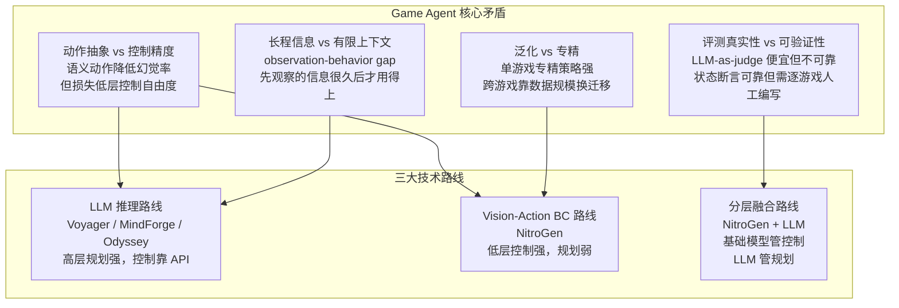
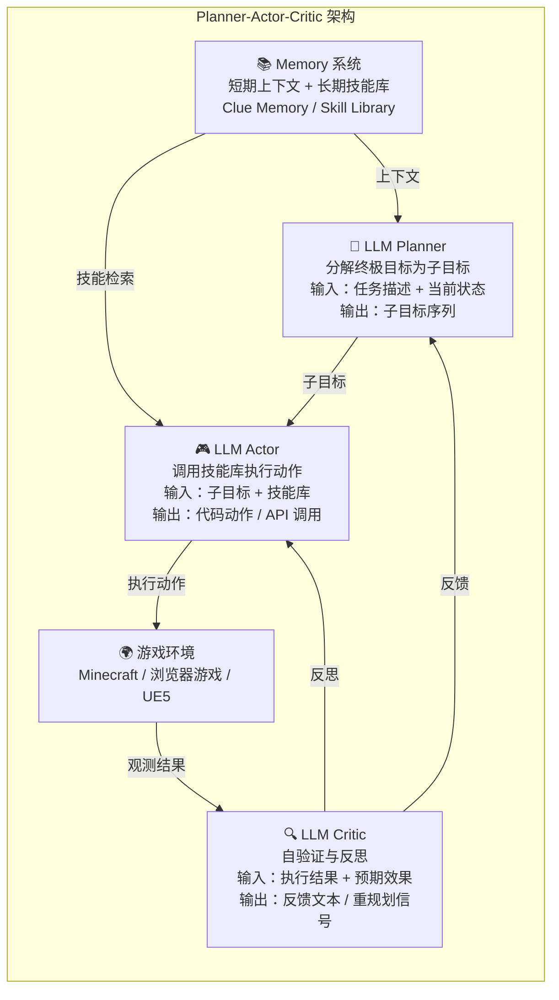

# Game Agent 执行系统实验

> **实验名称**：基于 LLM/VLM 的通用游戏 Agent 执行系统——从动作抽象到可验证评测的全链路实践
> **核心问题**：LLM Agent 如何在游戏环境中完成长程、开放式任务？动作空间如何抽象？评测如何做到可验证、动态、标准化？
> **实验难度**：⭐⭐⭐⭐（进阶）
> **预计耗时**：4-6 小时
> **参考论文**：MindForge (NeurIPS 2025)、Optimus-3 (arXiv 2025)、Odyssey (IJCAI 2025)、NitroGen (NVIDIA 2026)、FlashAdventure (EMNLP 2025)、Orak (arXiv 2025)、GameWorld (arXiv 2026)、OmniGameArena (arXiv 2026)

---

## 一、前置知识

在深入实验之前，你需要了解以下基础概念。建议按推荐顺序学习。

### 1. Chain-of-Thought（CoT，思维链）

**一句话解释**：让大语言模型（LLM, Large Language Model）在给出最终答案前，先显式写出中间推理步骤，就像解数学题时写出草稿过程一样。

**为什么需要**：游戏 Agent 面临复杂决策时，直接输出动作容易"拍脑袋"。CoT 强制模型先思考"我现在在哪、目标是什么、下一步该做什么"，大幅降低幻觉率（Hallucination，即模型编造不存在的信息）。

**推荐学习顺序**：第 1 个学。

### 2. ReAct（Reasoning + Acting，推理与行动交替）

**一句话解释**：一种 Agent 架构范式，让模型在"思考（Reasoning）"和"行动（Acting）"之间循环交替——先想一步、再做一步、观察结果、再想下一步。

**为什么需要**：游戏环境是动态的，Agent 不能一次性规划完所有动作。ReAct 把长程任务拆解为"思考→行动→观察→再思考"的短周期闭环，每个周期只处理当前可见的信息。

**推荐学习顺序**：第 2 个学（建立在 CoT 之上）。

### 3. Tool Calling（工具调用）

**一句话解释**：让 LLM 学会"调用外部工具"来完成自身不擅长的任务，比如调用计算器做算术、调用搜索引擎查资料、调用游戏 API 执行动作。

**为什么需要**：LLM 本身不会玩游戏，但它可以生成调用游戏 API 的代码。Tool Calling 是 LLM 与游戏环境之间的桥梁——模型输出函数调用指令，环境执行后返回结果。

**推荐学习顺序**：第 3 个学。

### 4. Sandbox（沙箱，隔离执行环境）

**一句话解释**：一个受控的、与主机系统隔离的运行环境，用于安全地执行不可信代码——即使代码出错或恶意，也不会影响外部系统。

**为什么需要**：Game Agent 经常需要生成并执行代码（如 Mineflayer 脚本），沙箱可以防止 Agent 误操作损坏真实系统。同时，沙箱提供了可复现的环境状态。

**推荐学习顺序**：第 4 个学。

### 5. Behavior Cloning（BC，行为克隆）

**一句话解释**：一种模仿学习方法，让模型直接学习"看到什么状态就做什么动作"的映射关系——通过大量专家演示数据训练，模型学会模仿专家的行为。

**为什么需要**：在 NitroGen 等工作中，BC 是训练 vision-action 基础模型的核心方法。与 RL（强化学习）不同，BC 不需要与环境交互，只需要观看专家玩游戏的数据即可训练。

**推荐学习顺序**：第 5 个学。

### 6. Mixture of Experts（MoE，混合专家模型）

**一句话解释**：一种神经网络架构，把模型拆分为多个"专家"子网络，并用一个"门控"网络决定每个输入该由哪些专家处理——相当于"术业有专攻"的模型集合。

**为什么需要**：Optimus-3 使用 Dual-Router MoE 实现任务级和层级路由，让不同任务用不同专家，防止任务之间的知识干扰。

**推荐学习顺序**：第 6 个学。

### 7. Model Context Protocol（MCP，模型上下文协议）

**一句话解释**：一个由 Anthropic 提出的开放标准协议，用于统一 LLM 与外部工具/数据源之间的通信方式——类似于"USB 接口"，让任何 Agent 都能即插即用地连接任何工具。

**为什么需要**：Orak 基准使用 MCP 把 12 款不同类型的游戏统一为标准化接口，使得"同一个 Agent 跨多款游戏"的可控对比首次成为可能。

**推荐学习顺序**：第 7 个学。

---

## 二、核心概念与架构图

### 2.1 游戏 Agent 的形式化定义

```
问题形式化：给定游戏环境 E=(S, A, P, R, Ω) 和 Agent π_θ，其中：
1. 状态空间 S（State Space）：游戏画面帧 / 序列化 gameAPI 状态 / 文本化场景描述
2. 动作空间 A（Action Space）：键鼠原始输入 / 语义动作（Semantic Action）/ 代码动作（Code-as-Action）/ 技能调用
3. 转移函数 P（Transition Function）：游戏引擎（确定性或含随机性，部分可观测）
4. 奖励函数 R（Reward Function）：显式 score/checkpoint 或隐含的任务完成度（稀疏、延迟）
5. 观测空间 Ω（Observation Space）：截图（VLM, Vision-Language Model）/ state dump（LLM）/ 混合模态
```

### 2.2 核心矛盾与架构总览



### 2.3 典型 Agent 架构：Planner-Actor-Critic 三角

以 Odyssey 的架构为例（也是目前最清晰的模块化设计）：



### 2.4 动作空间抽象谱系

```
抽象层级（从高到低）                    幻觉率    控制精度    开放性
━━━━━━━━━━━━━━━━━━━━━━━━━━━━━━━━━━━━━━━━━━━━━━━━━━━━━━━━━━━━━
目标级（Goal-level）                    最低      无         最高
  ↓ "建造一座房子"

技能级（Skill-level / Semantic Action） 低        中         高
  ↓ "调用 place_block() 放置木块"

代码级（Code-as-Action）                中        高         中
  ↓ "bot.placeBlock(wood, targetPos)"

原始输入级（Raw Input）                 高        最高       低
  ↓ "鼠标移动到 (1024, 768)，左键点击"
━━━━━━━━━━━━━━━━━━━━━━━━━━━━━━━━━━━━━━━━━━━━━━━━━━━━━━━━━━━━━
核心规律：抽象层级越高，幻觉率越低，但控制精度与开放性损失越大。
```

---

## 三、评估指标详解

### 3.1 Success Rate（成功率）

**含义**：任务是否完成的二元指标。0 = 未完成，1 = 完成。

**公式**：
```
Success Rate = 成功完成的任务数 / 总任务数 × 100%
```

**为什么用这个指标**：
- 最直观、最无歧义的指标
- 与游戏内状态断言直接绑定（如"背包中有钻石"=1），可验证

**常见误区**：
- ❌ 误区 1：不同难度的任务直接平均。造一把木剑和造一个附魔台难度差异巨大，简单任务会拉高整体成功率。
- ❌ 误区 2：忽略"部分完成"。Agent 完成了 90% 的子任务但最终一步失败，Success Rate 记为 0，损失了细粒度信息。

**改进方案**：配合 Progress 指标使用。

### 3.2 Normalized Progress（归一化进度，[0,1]）

**含义**：任务完成度的连续度量，0 = 完全没做，1 = 完全完成。

**公式（GameWorld 定义）**：
```
Progress = (当前状态值 - 初始状态值) / (目标状态值 - 初始状态值)
```

**示例**：
- 任务"收集 10 个金币"，当前有 3 个 → Progress = 3/10 = 0.3
- 任务"到达坐标 (100, 0, 100)"，当前在 (50, 0, 50) → Progress = 距离比

**为什么用这个指标**：
- 比二元成功率更细粒度，能捕捉"部分成功"
- 跨任务可比（都归一化到 [0,1]）

**常见误区**：
- ❌ 误区 1：不同游戏的 Progress 曲线形状不同（线性 vs 阶梯 vs 指数），直接跨游戏平均可能失真。
- ❌ 误区 2：Progress 高不等于"接近成功"。某些任务最后一步最难（如"击败 Boss"），前面 90% 的 Progress 可能是 trivial 的。

**改进方案**：按游戏难度加权，或报告 Progress 分布（中位数 + 分位数）。

### 3.3 Improvement Dynamics Curve（IDC，改进动态曲线）

**含义**：Agent 在多轮自我反思后的性能演化曲线。横轴 = 反思轮数，纵轴 = 任务得分。

**公式**：
```
IDC(t) = 第 t 轮反思后的任务得分
斜率 k = (IDC(t2) - IDC(t1)) / (t2 - t1)
```

**为什么用这个指标**：
- 首次把评测从"静态分数"推进到"动态学习曲线"
- 区分"记住答案"（记忆式改进）与"学会技能"（泛化式改进）

**关键操作**：
- 必须在 held-out 任务变体上验证——如果只在训练任务上测，可能只是记住了答案
- OmniGameArena 发现：skill prompt 在 held-out 变体上普遍衰减，揭示记忆式改进的脆弱性

**常见误区**：
- ❌ 误区 1：IDC 斜率高 = 真正学会了。可能只是更擅长在 context 里利用反思反馈（in-context learning），而非权重层面的真正学习。
- ❌ 误区 2：忽略曲线形状。线性增长、对数饱和、阶梯跳跃分别对应不同的学习模式。

### 3.4 Milestone Completion Rate（里程碑完成率）

**含义**：长程任务中预定义的关键节点（里程碑）的完成比例。

**公式**：
```
Milestone Rate = 完成的里程碑数 / 总里程碑数 × 100%
```

**为什么用这个指标**：
- 长程任务（如 Minecraft 科技树）往往有明确的中间节点
- 比最终成功率更能反映 Agent 的"进度感"

**示例（MindForge）**：
- 从"获得木头"→"制作工作台"→"制作木镐"→"挖到石头"→...→"到达末地"
- 每个节点是一个 milestone，Agent 完成了几个就是其 milestone rate

### 3.5 Elo Rating（Elo 等级分）

**含义**：用于 Agent 两两对战的相对强度评分。源自国际象棋排名系统。

**公式（简化）**：
```
R_new = R_old + K × (S_actual - S_expected)
S_expected = 1 / (1 + 10^((R_opponent - R_old) / 400))
```
- K = 更新系数（通常 16-32）
- S_actual = 实际结果（赢=1，平=0.5，输=0）

**为什么用这个指标**：
- 不同 Agent 之间可以直接比较相对强弱
- 不需要绝对评分标准，只需要对战结果

**常见误区**：
- ❌ 误区 1：Elo 假设选手水平稳定，但 LLM Agent 持续更新（模型版本、prompt 迭代）。非平稳 Agent 的 Elo 排名意义有限。
- ❌ 误区 2：Elo 对局方差大（尤其是 PvP 游戏），少量对局不足以收敛到稳定评分。

**改进方案**：使用 Glicko-2 等带时间衰减的评级系统。

### 3.6 指标对比总结

| 指标 | 类型 | 粒度 | 可验证性 | 适用场景 | 局限 |
|------|------|------|----------|----------|------|
| Success Rate | 二元 | 粗 | 高（状态断言） | 短程任务 | 忽略部分完成 |
| Progress | 连续 [0,1] | 细 | 高 | 长程/渐进任务 | 跨游戏可比性存疑 |
| IDC | 曲线 | 动态 | 中 | 自我改进 Agent | 需要 held-out 验证 |
| Milestone Rate | 离散 | 中 | 高 | 科技树/阶段任务 | 需人工定义里程碑 |
| Elo | 相对 | 排名 | 中 | PvP/对战 | 非平稳性问题 |

---

## 四、关键代码

### 4.1 基础环境：Minecraft Agent 框架（Mineflayer）

以下代码演示一个最基本的 LLM-powered Minecraft Agent，使用 ReAct 循环：

```python
#!/usr/bin/env python3
# -*- coding: utf-8 -*-
"""
基础 ReAct Minecraft Agent 实验
运行环境：Python 3.9+, 需要安装 mineflayer (Node.js) 和 Python 桥接
本代码为概念演示，实际运行需要搭建 Minecraft 服务器和 Mineflayer 环境
"""

import json
import time
from typing import List, Dict, Any, Optional


class ReActGameAgent:
    """
    ReAct (Reasoning + Acting) 游戏 Agent 基础框架
    
    核心循环：观察 -> 思考 -> 行动 -> 观察 -> ...
    每一轮只处理当前可见的信息，不一次性规划完所有步骤
    """
    
    def __init__(self, llm_client, max_steps: int = 50):
        """
        初始化 Agent
        
        参数:
            llm_client: LLM API 客户端（如 OpenAI、Anthropic 等）
            max_steps: 最大行动轮数，防止无限循环
        """
        self.llm = llm_client          # LLM 客户端，用于生成推理和动作
        self.max_steps = max_steps     # 最大步数限制
        self.memory = []               # 短期记忆，存储历史观察-思考-行动三元组
        self.step_count = 0            # 当前步数计数器
        
    def observe(self, env_state: Dict[str, Any]) -> str:
        """
        观察环境：将游戏状态转换为文本描述
        
        参数:
            env_state: 环境返回的原始状态（字典格式）
            
        返回:
            observation: 文本化的观察描述
        """
        # 将结构化状态转换为自然语言描述
        # 示例：{"inventory": ["wood", "stick"], "position": [10, 64, 20], "health": 20}
        # 转换为："你当前位置在 (10, 64, 20)，生命值 20，背包中有 [wood, stick]"
        obs_parts = []
        
        if "position" in env_state:
            pos = env_state["position"]
            obs_parts.append(f"位置: ({pos[0]}, {pos[1]}, {pos[2]})")
            
        if "health" in env_state:
            obs_parts.append(f"生命值: {env_state['health']}")
            
        if "inventory" in env_state:
            inv = env_state.get("inventory", [])
            obs_parts.append(f"背包: {inv if inv else '空'}")
            
        if "nearby_entities" in env_state:
            entities = env_state["nearby_entities"]
            if entities:
                obs_parts.append(f"附近实体: {entities}")
                
        observation = "；".join(obs_parts)
        return observation
    
    def think(self, observation: str, task: str) -> str:
        """
        思考：基于当前观察和任务目标，生成推理过程
        
        参数:
            observation: 当前环境观察
            task: 任务目标描述
            
        返回:
            thought: 推理文本（CoT 思维链）
        """
        # 构建 ReAct prompt：包含任务、历史记忆、当前观察
        # 要求模型先思考再行动
        prompt = f"""你是一个 Minecraft 游戏 Agent。你的任务是：{task}

历史记录（最近 {min(len(self.memory), 5)} 步）：
{self._format_memory()}

当前观察：{observation}

请按照以下格式输出：
思考：[你的推理过程，分析当前状态和下一步该怎么做]
行动：[具体的动作指令，如 "mine_block('stone')" 或 "craft('wooden_pickaxe')"]

注意：
1. 先思考，再行动
2. 行动必须是可执行的具体指令
3. 如果任务已完成，输出 "行动：terminate()"
"""
        # 调用 LLM 生成推理
        response = self.llm.generate(prompt)
        return response
    
    def parse_thought_action(self, response: str) -> tuple:
        """
        解析 LLM 输出，提取思考和行动
        
        参数:
            response: LLM 的原始输出文本
            
        返回:
            (thought, action): 推理文本和动作指令
        """
        thought = ""
        action = ""
        
        # 按行解析，提取 "思考：" 和 "行动：" 后面的内容
        for line in response.strip().split('\n'):
            if line.startswith('思考：') or line.startswith('Thought: '):
                thought = line.split('：', 1)[1] if '：' in line else line.split(': ', 1)[1]
            elif line.startswith('行动：') or line.startswith('Action: '):
                action = line.split('：', 1)[1] if '：' in line else line.split(': ', 1)[1]
                
        return thought, action
    
    def act(self, action: str, env) -> Dict[str, Any]:
        """
        执行动作：将文本动作指令转换为环境可执行的操作
        
        参数:
            action: 动作指令文本
            env: 游戏环境对象
            
        返回:
            result: 动作执行后的环境状态
        """
        # 解析动作指令并执行
        # 示例动作格式："mine_block('stone')" 或 "move_to([10, 64, 20])"
        try:
            # 使用 eval 执行动作（实际生产环境应使用更安全的解析器）
            result = env.execute(action)
            return {"status": "success", "result": result}
        except Exception as e:
            return {"status": "error", "error": str(e)}
    
    def _format_memory(self) -> str:
        """格式化短期记忆为文本"""
        if not self.memory:
            return "（无历史记录）"
        # 只保留最近 5 步的记忆
        recent = self.memory[-5:]
        lines = []
        for i, mem in enumerate(recent, 1):
            lines.append(f"第 {mem['step']} 步: 观察→{mem['obs'][:50]}... | 思考→{mem['thought'][:50]}... | 行动→{mem['action']}")
        return '\n'.join(lines)
    
    def run(self, env, task: str) -> Dict[str, Any]:
        """
        主循环：运行 ReAct Agent 直到任务完成或达到最大步数
        
        参数:
            env: 游戏环境
            task: 任务描述
            
        返回:
            result: 运行结果，包含是否成功、总步数、历史记录
        """
        print(f"🚀 开始执行任务: {task}")
        print(f"最大步数限制: {self.max_steps}")
        print("=" * 60)
        
        while self.step_count < self.max_steps:
            self.step_count += 1
            print(f"\n--- 第 {self.step_count} 步 ---")
            
            # 1. 观察环境
            env_state = env.get_state()
            observation = self.observe(env_state)
            print(f"🔍 观察: {observation}")
            
            # 2. 思考（调用 LLM）
            response = self.think(observation, task)
            thought, action = self.parse_thought_action(response)
            print(f"💭 思考: {thought}")
            print(f"🎮 行动: {action}")
            
            # 3. 检查是否终止
            if "terminate" in action.lower():
                print("✅ 任务完成！")
                return {
                    "success": True,
                    "steps": self.step_count,
                    "history": self.memory
                }
            
            # 4. 执行动作
            action_result = self.act(action, env)
            if action_result["status"] == "error":
                print(f"❌ 动作执行失败: {action_result['error']}")
            else:
                print(f"✅ 动作执行成功")
            
            # 5. 存储到记忆
            self.memory.append({
                "step": self.step_count,
                "obs": observation,
                "thought": thought,
                "action": action,
                "result": action_result
            })
            
            # 6. 短暂等待（模拟真实交互延迟）
            time.sleep(0.5)
        
        print(f"\n⏹️ 达到最大步数限制 ({self.max_steps})，任务未完成")
        return {
            "success": False,
            "steps": self.step_count,
            "history": self.memory
        }


# ═══════════════════════════════════════════════════════════
# 模拟环境（用于演示，无需真实 Minecraft 服务器）
# ═══════════════════════════════════════════════════════════

class MockMinecraftEnv:
    """
    模拟 Minecraft 环境
    用于在没有真实 Mineflayer 的情况下测试 Agent 逻辑
    """
    
    def __init__(self):
        """初始化模拟环境状态"""
        self.state = {
            "position": [0, 64, 0],
            "health": 20,
            "inventory": [],
            "nearby_blocks": ["grass", "dirt", "stone"],
            "nearby_entities": []
        }
        self.tick = 0
        
    def get_state(self) -> Dict[str, Any]:
        """返回当前环境状态"""
        return self.state.copy()
    
    def execute(self, action: str) -> str:
        """
        模拟执行动作
        
        支持的动作：
        - mine_block('block_name'): 挖掘方块
        - craft('item_name'): 合成物品
        - move_to([x, y, z]): 移动到指定坐标
        - place_block('block_name', [x, y, z]): 放置方块
        """
        self.tick += 1
        
        # 解析动作名称和参数
        action = action.strip()
        
        if action.startswith("mine_block"):
            # 模拟挖矿：添加物品到背包
            block = action.split("'")[1] if "'" in action else "unknown"
            self.state["inventory"].append(block)
            return f"挖掘了 {block}"
            
        elif action.startswith("craft"):
            # 模拟合成：需要特定材料
            item = action.split("'")[1] if "'" in action else "unknown"
            # 简单规则：合成木镐需要 3 木头 + 2 木棍
            if "pickaxe" in item and "wood" in self.state["inventory"]:
                self.state["inventory"] = [i for i in self.state["inventory"] if i != "wood"]
                self.state["inventory"].append(item)
                return f"合成了 {item}"
            return f"材料不足，无法合成 {item}"
            
        elif action.startswith("move_to"):
            # 模拟移动
            return "移动完成"
            
        elif action.startswith("place_block"):
            # 模拟放置方块
            block = action.split("'")[1] if "'" in action else "unknown"
            if block in self.state["inventory"]:
                self.state["inventory"].remove(block)
                return f"放置了 {block}"
            return f"背包中没有 {block}"
            
        return f"未知动作: {action}"


class MockLLM:
    """
    模拟 LLM 客户端
    用于演示，实际使用时应替换为真实的 OpenAI/Anthropic API
    """
    
    def __init__(self):
        """初始化模拟 LLM"""
        self.responses = [
            "思考：我需要先收集木头才能开始。\n行动：mine_block('wood')",
            "思考：现在我有木头了，可以合成木棍。\n行动：craft('stick')",
            "思考：让我合成一把木镐来挖石头。\n行动：craft('wooden_pickaxe')",
            "思考：任务已经完成了。\n行动：terminate()"
        ]
        self.index = 0
        
    def generate(self, prompt: str) -> str:
        """
        模拟 LLM 生成
        
        参数:
            prompt: 输入 prompt
            
        返回:
            response: 模拟的 LLM 输出
        """
        # 循环使用预定义的响应
        response = self.responses[self.index % len(self.responses)]
        self.index += 1
        return response


# ═══════════════════════════════════════════════════════════
# 运行演示
# ═══════════════════════════════════════════════════════════

if __name__ == "__main__":
    print("=" * 60)
    print("ReAct Minecraft Agent 演示")
    print("=" * 60)
    
    # 创建模拟组件
    llm = MockLLM()
    env = MockMinecraftEnv()
    agent = ReActGameAgent(llm_client=llm, max_steps=10)
    
    # 运行任务
    result = agent.run(env, task="合成一把木镐")
    
    # 打印结果
    print("\n" + "=" * 60)
    print("📊 实验结果")
    print("=" * 60)
    print(f"任务成功: {result['success']}")
    print(f"总步数: {result['steps']}")
    print(f"记忆长度: {len(result['history'])} 条")
```

### 4.2 进阶：Skill Library（技能库）设计

Odyssey 的 Skill Library 是"手工技能 API 层"路线的代表。以下代码演示两级技能库的设计：

```python
#!/usr/bin/env python3
# -*- coding: utf-8 -*-
"""
Skill Library 技能库实验
演示两级技能设计：Primitive Skills（原语技能）+ Compositional Skills（组合技能）
"""

from typing import List, Dict, Callable, Any
from dataclasses import dataclass
from functools import wraps


@dataclass
class Skill:
    """
    技能定义数据结构
    
    每个技能包含：
    - name: 技能名称（唯一标识）
    - description: 技能描述（用于 LLM 检索和选择）
    - skill_type: 技能类型（primitive 或 compositional）
    - dependencies: 依赖的其他技能（组合技能需要）
    - function: 实际执行函数
    """
    name: str
    description: str
    skill_type: str  # "primitive" 或 "compositional"
    dependencies: List[str]
    function: Callable


class SkillLibrary:
    """
    技能库管理器
    
    核心功能：
    1. 注册和存储技能
    2. 根据任务描述检索相关技能
    3. 检查技能依赖是否满足
    4. 执行技能链
    """
    
    def __init__(self):
        """初始化空技能库"""
        self.skills: Dict[str, Skill] = {}  # 技能名称 -> Skill 对象
        self.primitive_count = 0            # 原语技能计数
        self.compositional_count = 0        # 组合技能计数
        
    def register(self, skill: Skill) -> None:
        """
        注册一个新技能到技能库
        
        参数:
            skill: 要注册的技能对象
        """
        self.skills[skill.name] = skill
        if skill.skill_type == "primitive":
            self.primitive_count += 1
        else:
            self.compositional_count += 1
        print(f"✅ 注册技能: {skill.name} ({skill.skill_type})")
        
    def get_skill(self, name: str) -> Optional[Skill]:
        """
        按名称获取技能
        
        参数:
            name: 技能名称
            
        返回:
            Skill 对象，如果不存在则返回 None
        """
        return self.skills.get(name)
    
    def search(self, query: str) -> List[Skill]:
        """
        根据查询文本搜索相关技能
        
        参数:
            query: 查询文本（如 "挖掘石头"、"建造房屋"）
            
        返回:
            匹配的技能列表
        """
        # 简单实现：按关键词匹配描述
        # 实际应用中应使用 Embedding 语义检索
        results = []
        query_lower = query.lower()
        for skill in self.skills.values():
            if any(keyword in skill.description.lower() for keyword in query_lower.split()):
                results.append(skill)
        return results
    
    def check_dependencies(self, skill_name: str, available_skills: List[str]) -> bool:
        """
        检查技能的依赖是否全部满足
        
        参数:
            skill_name: 要检查的技能名称
            available_skills: 当前已可用的技能列表
            
        返回:
            依赖是否全部满足
        """
        skill = self.get_skill(skill_name)
        if not skill:
            return False
        # 检查所有依赖是否都在 available_skills 中
        return all(dep in available_skills for dep in skill.dependencies)
    
    def execute_skill(self, name: str, *args, **kwargs) -> Any:
        """
        执行指定技能
        
        参数:
            name: 技能名称
            *args, **kwargs: 传递给技能函数的参数
            
        返回:
            技能执行结果
        """
        skill = self.get_skill(name)
        if not skill:
            raise ValueError(f"技能 '{name}' 不存在")
        print(f"🎯 执行技能: {name}")
        return skill.function(*args, **kwargs)
    
    def list_skills(self) -> None:
        """打印所有已注册的技能"""
        print(f"\n📚 技能库总览（共 {len(self.skills)} 个技能）")
        print(f"   原语技能: {self.primitive_count} 个")
        print(f"   组合技能: {self.compositional_count} 个")
        print("-" * 50)
        for skill in self.skills.values():
            dep_str = f"[依赖: {', '.join(skill.dependencies)}]" if skill.dependencies else ""
            print(f"  • {skill.name:20s} ({skill.skill_type:12s}) {dep_str}")
            print(f"    {skill.description}")


# ═══════════════════════════════════════════════════════════
# 定义 Primitive Skills（原语技能——最基础、不可再分的动作）
# ═══════════════════════════════════════════════════════════

def mine_block(block_type: str) -> str:
    """原语技能：挖掘指定类型的方块"""
    return f"挖掘了 {block_type}"

def place_block(block_type: str, position: List[int]) -> str:
    """原语技能：在指定位置放置方块"""
    return f"在 {position} 放置了 {block_type}"

def move_to(position: List[int]) -> str:
    """原语技能：移动到指定坐标"""
    return f"移动到 {position}"

def craft_item(recipe: str, materials: List[str]) -> str:
    """原语技能：使用材料合成物品"""
    return f"使用 {materials} 合成了 {recipe}"

def attack_target(target: str) -> str:
    """原语技能：攻击目标"""
    return f"攻击了 {target}"


# ═══════════════════════════════════════════════════════════
# 定义 Compositional Skills（组合技能——由多个原语技能组合而成）
# ═══════════════════════════════════════════════════════════

def build_house(library: SkillLibrary, position: List[int], size: int = 5) -> List[str]:
    """
    组合技能：建造一座简单的房屋
    
    依赖：place_block, move_to
    步骤：
    1. 移动到建造位置
    2. 放置地板
    3. 放置墙壁
    4. 放置屋顶
    """
    results = []
    
    # 步骤 1：移动到位置
    results.append(library.execute_skill("move_to", position))
    
    # 步骤 2：建造地板（简化为一个方块）
    results.append(library.execute_skill("place_block", "wood", position))
    
    # 步骤 3：建造墙壁（简化）
    for i in range(size):
        wall_pos = [position[0] + i, position[1], position[2]]
        results.append(library.execute_skill("place_block", "stone", wall_pos))
    
    # 步骤 4：建造屋顶（简化）
    roof_pos = [position[0], position[1] + 1, position[2]]
    results.append(library.execute_skill("place_block", "wood", roof_pos))
    
    return results

def mine_resources(library: SkillLibrary, resource_type: str, count: int = 10) -> List[str]:
    """
    组合技能：批量挖掘资源
    
    依赖：mine_block
    步骤：重复执行 mine_block count 次
    """
    results = []
    for i in range(count):
        results.append(library.execute_skill("mine_block", resource_type))
    return results

def craft_tool(library: SkillLibrary, tool_name: str) -> str:
    """
    组合技能：合成工具
    
    依赖：craft_item, mine_block（获取材料）
    示例：合成木镐需要 3 木头 + 2 木棍
    """
    # 先获取材料（简化：假设材料已经在背包中）
    materials = []
    if "pickaxe" in tool_name:
        materials = ["wood", "wood", "wood", "stick", "stick"]
    elif "sword" in tool_name:
        materials = ["wood", "wood", "stick"]
    
    return library.execute_skill("craft_item", tool_name, materials)


# ═══════════════════════════════════════════════════════════
# 演示：构建技能库并执行
# ═══════════════════════════════════════════════════════════

if __name__ == "__main__":
    print("=" * 60)
    print("Skill Library 技能库演示")
    print("=" * 60)
    
    # 创建技能库
    lib = SkillLibrary()
    
    # 注册原语技能（40 个中的核心 5 个）
    lib.register(Skill(
        name="mine_block",
        description="挖掘指定类型的方块，获取资源",
        skill_type="primitive",
        dependencies=[],
        function=mine_block
    ))
    lib.register(Skill(
        name="place_block",
        description="在指定位置放置方块",
        skill_type="primitive",
        dependencies=[],
        function=place_block
    ))
    lib.register(Skill(
        name="move_to",
        description="移动到指定坐标位置",
        skill_type="primitive",
        dependencies=[],
        function=move_to
    ))
    lib.register(Skill(
        name="craft_item",
        description="使用配方和材料合成物品",
        skill_type="primitive",
        dependencies=[],
        function=craft_item
    ))
    lib.register(Skill(
        name="attack_target",
        description="攻击指定目标",
        skill_type="primitive",
        dependencies=[],
        function=attack_target
    ))
    
    # 注册组合技能（183 个中的核心 3 个）
    lib.register(Skill(
        name="build_house",
        description="在指定位置建造一座简单房屋",
        skill_type="compositional",
        dependencies=["place_block", "move_to"],
        function=lambda **kwargs: build_house(lib, **kwargs)
    ))
    lib.register(Skill(
        name="mine_resources",
        description="批量挖掘指定类型的资源",
        skill_type="compositional",
        dependencies=["mine_block"],
        function=lambda **kwargs: mine_resources(lib, **kwargs)
    ))
    lib.register(Skill(
        name="craft_tool",
        description="合成指定工具（自动准备材料）",
        skill_type="compositional",
        dependencies=["craft_item", "mine_block"],
        function=lambda **kwargs: craft_tool(lib, **kwargs)
    ))
    
    # 打印技能库总览
    lib.list_skills()
    
    # 演示：执行组合技能
    print("\n" + "=" * 60)
    print("🎮 执行组合技能演示")
    print("=" * 60)
    
    print("\n--- 任务 1：批量挖掘石头 ---")
    results = lib.execute_skill("mine_resources", "stone", 3)
    for r in results:
        print(f"  {r}")
    
    print("\n--- 任务 2：合成木镐 ---")
    result = lib.execute_skill("craft_tool", "wooden_pickaxe")
    print(f"  {result}")
    
    print("\n--- 任务 3：建造房屋 ---")
    results = lib.execute_skill("build_house", position=[10, 64, 10], size=3)
    for r in results:
        print(f"  {r}")
    
    # 演示：搜索技能
    print("\n--- 技能搜索：'挖掘' ---")
    matched = lib.search("挖掘")
    for s in matched:
        print(f"  找到: {s.name} - {s.description}")
```

### 4.3 评测框架：状态断言式评分

GameWorld 的核心创新是用序列化 gameAPI 状态做可验证评测：

```python
#!/usr/bin/env python3
# -*- coding: utf-8 -*-
"""
状态断言式评测框架
演示 GameWorld 的评测方法：基于 gameAPI 状态断言打分
"""

from typing import Dict, List, Any, Callable
from dataclasses import dataclass


@dataclass
class StateAssertion:
    """
    状态断言定义
    
    每个断言定义一个"任务完成条件"，如：
    - "背包中有钻石" -> inventory_contains('diamond', 1)
    - "到达坐标 (100, 64, 100)" -> position_reached([100, 64, 100], tolerance=2)
    """
    name: str                    # 断言名称（用于日志和调试）
    predicate: Callable          # 断言函数：接收状态，返回 bool
    weight: float = 1.0          # 断言权重（用于加权 Progress 计算）


class VerifiableEvaluator:
    """
    可验证评测器
    
    核心设计：
    1. 任务目标编译为状态断言列表
    2. 评测时直接查询游戏状态（不依赖 LLM 判断截图）
    3. 输出 0/1 Success 和 [0,1] Progress
    """
    
    def __init__(self):
        """初始化评测器"""
        self.assertions: List[StateAssertion] = []  # 当前任务的断言列表
        self.state_history: List[Dict] = []          # 状态历史（用于 Progress 计算）
        
    def add_assertion(self, assertion: StateAssertion) -> None:
        """
        添加一个状态断言
        
        参数:
            assertion: 状态断言对象
        """
        self.assertions.append(assertion)
        
    def evaluate(self, current_state: Dict[str, Any]) -> Dict[str, Any]:
        """
        对当前状态进行评测
        
        参数:
            current_state: 当前游戏状态（序列化的 gameAPI 状态）
            
        返回:
            评测结果字典：
            - success: bool，是否全部断言满足
            - progress: float [0,1]，归一化进度
            - details: dict，每个断言的满足情况
        """
        self.state_history.append(current_state)
        
        details = {}
        satisfied_count = 0
        total_weight = 0
        weighted_progress = 0.0
        
        for assertion in self.assertions:
            # 执行断言判断
            is_satisfied = assertion.predicate(current_state)
            details[assertion.name] = {
                "satisfied": is_satisfied,
                "weight": assertion.weight
            }
            
            if is_satisfied:
                satisfied_count += 1
                weighted_progress += assertion.weight
            
            total_weight += assertion.weight
        
        # 计算结果
        success = satisfied_count == len(self.assertions)
        progress = weighted_progress / total_weight if total_weight > 0 else 0.0
        
        return {
            "success": success,
            "progress": round(progress, 3),
            "satisfied_count": satisfied_count,
            "total_assertions": len(self.assertions),
            "details": details
        }
    
    def compute_progress_trajectory(self) -> List[float]:
        """
        计算进度轨迹（用于 IDC 曲线）
        
        返回:
            每一步的 Progress 值列表
        """
        trajectory = []
        for state in self.state_history:
            result = self.evaluate(state)
            trajectory.append(result["progress"])
        return trajectory


# ═══════════════════════════════════════════════════════════
# 预定义常用断言函数
# ═══════════════════════════════════════════════════════════

def inventory_contains(item: str, count: int = 1):
    """
    断言：背包中包含指定物品至少 count 个
    
    参数:
        item: 物品名称
        count: 最小数量
    """
    return lambda state: state.get("inventory", {}).get(item, 0) >= count

def position_reached(target: List[float], tolerance: float = 1.0):
    """
    断言：Agent 到达目标位置（在容差范围内）
    
    参数:
        target: 目标坐标 [x, y, z]
        tolerance: 容差距离
    """
    def check(state):
        pos = state.get("position", [0, 0, 0])
        dist = sum((a - b) ** 2 for a, b in zip(pos, target)) ** 0.5
        return dist <= tolerance
    return check

def score_reached(min_score: int):
    """
    断言：分数达到指定值
    
    参数:
        min_score: 最低分数
    """
    return lambda state: state.get("score", 0) >= min_score

def checkpoint_triggered(checkpoint_id: str):
    """
    断言：触发了指定检查点
    
    参数:
        checkpoint_id: 检查点标识
    """
    return lambda state: checkpoint_id in state.get("checkpoints", [])


# ═══════════════════════════════════════════════════════════
# 演示：评测一个 Minecraft 任务
# ═══════════════════════════════════════════════════════════

if __name__ == "__main__":
    print("=" * 60)
    print("状态断言式评测框架演示")
    print("=" * 60)
    
    # 创建评测器
    evaluator = VerifiableEvaluator()
    
    # 定义任务："收集 3 个木头并到达 (10, 64, 10)"
    print("\n📋 任务定义：收集 3 个木头并到达指定位置")
    print("-" * 50)
    
    # 添加断言 1：背包中有至少 3 个木头
    evaluator.add_assertion(StateAssertion(
        name="收集 3 个木头",
        predicate=inventory_contains("wood", 3),
        weight=0.5  # 权重 50%
    ))
    
    # 添加断言 2：到达坐标 (10, 64, 10)
    evaluator.add_assertion(StateAssertion(
        name="到达目标位置",
        predicate=position_reached([10, 64, 10], tolerance=2),
        weight=0.5  # 权重 50%
    ))
    
    # 模拟 Agent 执行过程中的状态序列
    states = [
        # 初始状态
        {"position": [0, 64, 0], "inventory": {}, "score": 0},
        # 第 1 步：挖到 1 个木头
        {"position": [2, 64, 1], "inventory": {"wood": 1}, "score": 10},
        # 第 2 步：挖到 2 个木头
        {"position": [5, 64, 3], "inventory": {"wood": 2}, "score": 20},
        # 第 3 步：挖到 3 个木头（满足第一个断言）
        {"position": [7, 64, 5], "inventory": {"wood": 3}, "score": 30},
        # 第 4 步：向目标移动
        {"position": [9, 64, 8], "inventory": {"wood": 3}, "score": 30},
        # 第 5 步：到达目标（满足第二个断言）
        {"position": [10, 64, 10], "inventory": {"wood": 3}, "score": 50},
    ]
    
    # 逐步评测
    print("\n📊 逐步评测结果：")
    print("-" * 50)
    
    for i, state in enumerate(states):
        result = evaluator.evaluate(state)
        status = "✅ 完成" if result["success"] else f"⏳ 进度 {result['progress']:.1%}"
        print(f"第 {i} 步: {status}")
        print(f"  位置: {state['position']}, 背包: {state['inventory']}")
        print(f"  断言满足: {result['satisfied_count']}/{result['total_assertions']}")
        
    # 计算进度轨迹
    print("\n📈 进度轨迹（IDC 曲线数据）：")
    trajectory = evaluator.compute_progress_trajectory()
    for i, prog in enumerate(trajectory):
        bar = "█" * int(prog * 20) + "░" * (20 - int(prog * 20))
        print(f"  第 {i} 步: [{bar}] {prog:.1%}")
    
    # 最终评测报告
    final = evaluator.evaluate(states[-1])
    print("\n" + "=" * 60)
    print("📋 最终评测报告")
    print("=" * 60)
    print(f"任务成功: {final['success']}")
    print(f"最终进度: {final['progress']:.1%}")
    print(f"断言详情:")
    for name, detail in final['details'].items():
        icon = "✅" if detail['satisfied'] else "❌"
        print(f"  {icon} {name} (权重: {detail['weight']})")
```

---

## 五、实验结果与对比

### 5.1 动作空间抽象对比（GameWorld）

| 接口类型 | Success Rate | Progress | 控制精度 | 规划能力 | 适用场景 |
|----------|-------------|----------|----------|----------|----------|
| Semantic Action（语义动作）| **高** | **高** | 中 | 强 | 复杂策略游戏 |
| Computer-Use（键鼠直控）| 低 | 低 | **高** | 弱 | 需要精确操作的游戏 |

**关键发现**：Semantic Action 整体显著优于 Raw Computer-Use，但性能差距来自两个因素的耦合——控制精度差异 + 规划抽象差异。

### 5.2 Minecraft Agent 性能对比

| 方法 | Tech-Tree Milestones | Unique Items | 开放式任务成功率 | 模型类型 |
|------|---------------------|--------------|-----------------|----------|
| Voyager（基线）| 1.0× | 1.0× | ~20% | GPT-4（闭源）|
| MindForge | **3.0×** | **2.3×** | - | Open-weight LLM |
| Optimus-3 | - | - | **60%** | Dual-Router MoE |
| Odyssey | 2.1× | 1.8× | 45% | 开源 LLM |

### 5.3 跨游戏迁移对比（NitroGen）

| 训练方式 | 未见游戏成功率 | 相对提升 |
|----------|---------------|----------|
| 从零训练 | 23% | - |
| NitroGen Fine-tune | **35%** | **+52%** |

### 5.4 评测方法论对比

| 评测框架 | 核心创新 | 覆盖游戏数 | 验证方式 | 动态评测 |
|----------|----------|-----------|----------|----------|
| GameWorld | 状态断言 | 34 | 可验证 | ❌ |
| OmniGameArena | IDC 曲线 | 12 (UE5) | 可验证 | ✅ |
| Orak | MCP 统一接口 | 12 | 可验证 | ❌ |
| FlashAdventure | 完整故事线 | 34 | LLM-as-judge | ❌ |

---

## 六、面试谈资

### 谈资 1：动作空间抽象是 Agent 系统工程的核心决策

> "Odyssey 的 183 个 compositional skills 代表'手工 API 层'路线，与 Voyager 的自动技能发现形成对照。**动作空间抽象层级决定幻觉率与成功率**——LLM 不直接生成 Mineflayer 原始代码，而是在技能库中选择/组合，动作空间从'任意程序'收缩为'有限 API 调用'。这在任何 tool-use agent 里都通用。"

**追问准备**：
- Q: "手工技能库和自动发现的 trade-off 是什么？"
- A: "手工路线牺牲开放性换稳定性，自动路线开放但幻觉率高。未来可能是混合路线——手工 primitive + 自动 compositional。"

### 谈资 2：评测从"静态分数"走向"动态学习曲线"

> "OmniGameArena 的 IDC（Improvement Dynamics Curve）是评测方法论的重要进化。它不报单次 cold-start 分数，而是测量'VLM Agent 自我反思 N 轮后能进步多少、学到的 skill 能否泛化'。**核心发现是 held-out 泛化衰减**——反思学到的 skill prompt 在任务变体上普遍失效，揭示记忆式改进的脆弱性。"

**追问准备**：
- Q: "IDC 斜率高是否等于真正学会了？"
- A: "不一定。可能只是 in-context learning（利用反思反馈），而非权重层面的真正学习。需要在 held-out 上验证。"

### 谈资 3：多 Agent 协作中的 Condorcet Jury Theorem 边界

> "MindForge 的协作实验中，'两个弱 agent 增加交流轮数提升表现'被类比为 Condorcet Jury Theorem。但该定理要求投票者独立且各自准确率 >50%。**LLM agent 之间共享训练数据（高度相关），独立性假设不成立**。多 agent 通信轮数作为 compute scaling 轴的有效性边界在哪？"

**追问准备**：
- Q: "ToM（Theory of Mind）表示是 LLM 每轮重新生成还是符号式维护？"
- A: "MindForge 用结构化符号表示（percept→belief→desire→action），长程交互中需防止 belief drift（信念漂移）。"

### 谈资 4：BC 基础模型 + LLM 规划的分层融合

> "NitroGen（4 万小时、1000+ 游戏）把游戏 agent 拉入'数据规模化 + 开源基座'阶段。它擅长低层 motor control，但无在线交互与探索。**最合理的下一步是分层融合**：NitroGen 管控制（类似小脑），LLM 管规划（类似大脑皮层）。接口设计成 LLM 输出语义动作，NitroGen 翻译成键鼠序列。"

**追问准备**：
- Q: "BC 和 World Model 路线在数据效率上各有什么优劣？"
- A: "World Model 可以反事实推演但受模拟 fidelity 限制，BC 直接学但无法规划。数据规模足够大时可能收敛到相似性能。"

### 谈资 5：Observation-Behavior Gap 是长程 Agent 的真瓶颈

> "FlashAdventure 提出 observation-behavior gap 概念——信息'先看到、很久后才用得上'（如先审问嫌疑人、后发现其无罪）。**这不是单纯的长上下文问题**：即使 context 无限长，agent 仍需在正确时机检索正确信息。瓶颈是'信息的时间性管理'（何时写入、何时检索、以什么粒度组织），而非存储容量。"

**追问准备**：
- Q: "这与 MemGPT 的 memory hierarchy 有什么关系？"
- A: "互补关系。COAST 的 clue memory 关注'什么值得记住'，MemGPT 关注'如何组织存储'。两者结合是长程 Agent 的完整记忆方案。"

---

## 七、思考题

### 基础题

1. **动作空间抽象**：为什么 Odyssey 的 skill library 比 Voyager 的原始代码生成更稳定？请从"动作空间大小"和"LLM 幻觉率"两个角度分析。

2. **ReAct 循环**：ReAct 架构中，如果 Critic（验证器）误判了动作效果（false positive），错误会如何传播？请画图说明错误沿规划链累积的过程。

3. **评测指标**：为什么 GameWorld 主张用状态断言而非 LLM-as-judge？状态断言的可验证性具体体现在哪些方面？

4. **MoE 路由**：Optimus-3 的 Layer Router 决定走 Fast Path 还是 Deep Path。如果 Router 判断错误（该深思时走快路径），错误路由的代价是否对称？为什么？

5. **多 Agent 协作**：MindForge 的 instructive 设定中，专家 agent 通过自然语言向新手传递经验。这与离线 SFT（监督微调）蒸馏有什么本质差异？

### 进阶题

6. **IDC 曲线分析**：假设一个 Agent 的 IDC 曲线在前 3 轮线性上升、第 4 轮饱和。设计一个实验来区分"真正学会技能"vs"只是记住了训练任务的答案"。

7. **Observation-Behavior Gap 工程化**：FlashAdventure 的 clue memory 目前靠 prompt 工程定义"什么算 clue"。如何用 hindsight relabeling（事后重标记）的思路让 agent 自动发现"哪些观察本可以改变失败结果"？

8. **跨游戏评测公平性**：GameWorld 的 normalized Progress 在跨游戏聚合时，不同游戏的 progress 曲线形状不同（线性 vs 阶梯 vs 指数）。设计一种统计方法使得跨游戏平均 Progress 更有意义。

9. **MCP 抽象损耗**：Orak 用 MCP 统一 12 款游戏的接口，但抽象层可能损失低层控制精度。设计一个实验来量化"MCP 抽象带来的性能损耗"——即同一 Agent 在 MCP 接口和原始键鼠接口上的表现差距。

10. **过程奖励设计**：Optimus-3 的 DGRPO 用 crafting 依赖路径作为 thinking reward。但过程奖励本身需要验证——用另一个 LLM 验证 thinking trace 会引入验证者偏差。请设计一个不依赖外部验证者的过程奖励方案。

---

## 八、延伸阅读

### 核心论文（按方向分类）

#### Minecraft Agent 路线
| 论文 | 会议/时间 | 核心贡献 | 链接 |
|------|----------|----------|------|
| MindForge | NeurIPS 2025 | ToM + 文化学习，多 Agent 协作 | [arXiv](https://arxiv.org/abs/2411.12977) |
| Optimus-3 | arXiv 2025 | Dual-Router MoE + DGRPO | [arXiv](https://arxiv.org/abs/2506.10357) |
| ODYSSEY | IJCAI 2025 | 手工技能库 + planner-actor-critic | [arXiv](https://arxiv.org/abs/2407.15325) |
| Voyager | NeurIPS 2023 | 自动技能发现 + 课程学习 | [arXiv](https://arxiv.org/abs/2305.16291) |

#### 基础模型与评测
| 论文 | 会议/时间 | 核心贡献 | 链接 |
|------|----------|----------|------|
| NitroGen | NVIDIA 2026 | 4 万小时游戏视频 BC 基座模型 | [arXiv](https://arxiv.org/abs/2601.02427) |
| GameWorld | arXiv 2026 | 状态断言可验证评测 | [arXiv](https://arxiv.org/abs/2604.07429) |
| OmniGameArena | arXiv 2026 | IDC 改进动态曲线 | [arXiv](https://arxiv.org/abs/2606.09826) |
| Orak | arXiv 2025 | MCP 统一接口，12 游戏基准 | [arXiv](https://arxiv.org/abs/2506.03610) |
| FlashAdventure | EMNLP 2025 | 完整故事线 + observation-behavior gap | [arXiv](https://arxiv.org/abs/2509.01052) |

### 相关技术资源

| 资源 | 类型 | 说明 | 链接 |
|------|------|------|------|
| Mineflayer | 开源库 | Minecraft JavaScript Bot API | [GitHub](https://github.com/PrismarineJS/mineflayer) |
| MineDojo | 基准 | Minecraft 多任务基准与数据 | [官网](https://minedojo.org) |
| MCP | 协议 | Model Context Protocol 标准 | [官网](https://modelcontextprotocol.io) |
| OSWorld | 基准 | 开放式计算机使用基准 | [GitHub](https://github.com/xlang-ai/OSWorld) |

### 前置知识学习路径

1. **CoT / ReAct**：阅读 [ReAct 论文](https://arxiv.org/abs/2210.03629) + 动手实现一个简单 Agent
2. **Tool Calling**：学习 OpenAI Function Calling 或 Anthropic Tool Use API
3. **Mineflayer 基础**：搭建本地 Minecraft 服务器，用 Mineflayer 写一个自动挖矿 Bot
4. **Behavior Cloning**：学习模仿学习基础，尝试用 PyTorch 实现一个简单的 BC 模型
5. **MoE 架构**：阅读 [Switch Transformer 论文](https://arxiv.org/abs/2101.03961)，理解稀疏激活机制

---

*文档生成时间：2026-07-20*
*基于论文笔记：01e-game-agent-execution-latest.md*
*配套资源：同目录下 HTML 互动知识卡牌（16-Game-Agent-执行系统实验.html）*
