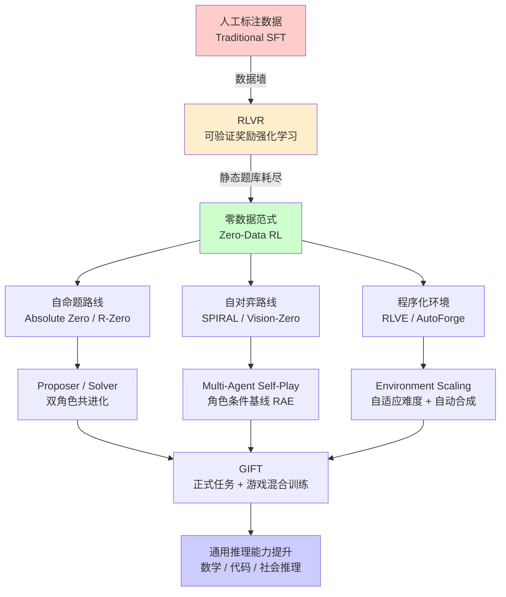

# 合成环境 RL 实验：让模型自己出题、自己对弈、自己进化

> **实验名称**：合成环境强化学习（Synthetic Environment RL）——从 Self-Play 到环境工业化
> **核心问题**：当人工题库耗尽后，如何用程序化环境和游戏化训练为 LLM 推理提供无限、可验证、自适应的奖励信号？
> **预计阅读时间**：40 分钟
> **配套代码**：文中所有 Python 示例可直接复制运行（需 Python 3.9+）

---

## 一、前置知识

在深入实验之前，你需要了解以下基础概念。建议按**推荐顺序**学习。

| 序号 | 概念 | 中文解释 | 为什么需要它 | 推荐学习顺序 |
|------|------|----------|--------------|--------------|
| 1 | **RLVR**（Reinforcement Learning with Verifiable Rewards，可验证奖励强化学习） | 一种 RL 训练范式：模型生成答案，由程序（而非人类）自动判定对错并给出奖励。 | 这是本实验的**基线方法**——所有后续方法都是对它缺点的改进。 | ⭐ 第 1 步 |
| 2 | **Self-Play**（自博弈） | 模型与"自己的副本"或"自己的历史版本"对弈/对抗，从而生成训练数据。 | 这是**零数据**的核心机制——不需要人类标注。 | ⭐ 第 2 步 |
| 3 | **CoT**（Chain-of-Thought，思维链） | 让模型在给出最终答案前，先生成中间的推理步骤。 | 合成环境 RL 的**动作空间**就是 CoT + 动作/答案。 | ⭐ 第 3 步 |
| 4 | **Verifier / Code Executor**（验证器 / 代码执行器） | 一个程序化的裁判：编译并运行代码，检查输出是否正确，返回二元奖励（对/错）。 | 它是**可验证奖励**的物理实现，防止模型"作弊"。 | ⭐ 第 4 步 |
| 5 | **PPO / GRPO**（近端策略优化 / 组相对策略优化） | LLM 强化学习的主流训练算法：PPO 用价值函数估计优势，GRPO 用同一问题的多个采样答案的相对得分来估计优势（省掉价值模型）。 | 这是**训练引擎**——所有实验都依赖它更新策略。 | ⭐ 第 5 步 |
| 6 | **Baseline**（基线 / 基准值） | 在 RL 中，baseline 是一个期望值，用于减去原始奖励，得到"超出预期"的信号（即 advantage，优势）。 | 核心难点：对手在变、环境在变，**静态 baseline 会失效**。 | ⭐ 第 6 步 |
| 7 | **Curriculum Learning**（课程学习） | 让模型从简单任务学起，逐步增加难度。 | 合成环境的**核心挑战**是"太简单没梯度，太难也学不到"。 | ⭐ 第 7 步 |
| 8 | **Zero-Sum Game**（零和博弈） | 一方赢多少，另一方就输多少，总收益恒为零。 | 井字棋、扑克都属于零和博弈，是**自博弈的天然土壤**。 | ⭐ 第 8 步 |

> 💡 **一句话总结**：RLVR 用程序当裁判 → Self-Play 让模型自己跟自己下棋 → 但对手变强导致信号非平稳 → 需要按"角色/环境"重新估计 baseline → 同时环境数量本身成了新的扩展轴。

---

## 二、核心概念与架构

### 2.1 大图景：三条主线

本方向的所有论文可以归入**三条主线**：

1. **零数据自博弈家族**（Absolute Zero → R-Zero → SPIRAL → Vision-Zero）：模型自己出题或自己对弈，完全不依赖人工数据。
2. **环境工业化**（RLVE → GEM → AutoForge）：证明"环境数量"是新的 scale 轴，并建造环境生产和训练的基础设施。
3. **游戏即非正式学习**（GIFT）：游戏不只是出题器，而是覆盖推理/规划/创造力/社会智能的广谱信号源。

### 2.2 核心架构图



### 2.3 关键技术对照

| 论文 | 信号来源 | 外部数据 | Verifier | 课程机制 | 关键算法 |
|------|----------|----------|----------|----------|----------|
| **SPIRAL** | 零和对弈 | 零 | 游戏规则 | 对手变强 | **RAE**（Role-conditioned Advantage Estimation） |
| **Absolute Zero** | 自命题 + executor | 零 | Code Executor | 学习进度 reward | Proposer/Solver RL |
| **R-Zero** | Challenger 出题 | 零 | 答案检查 | Edge-of-learnability | 双模型共进化 |
| **Vision-Zero** | 视觉博弈 | 零 | 游戏规则 | Iterative-SPO | Self-Play + RLVR 交替 |
| **RLVE** | 程序化环境 | 零（程序化） | 算法验证器 | 自适应难度 | 环境难度动态调整 |
| **GEM** | 环境套件 | 取决于环境 | 环境自带 | 无（基础设施） | **ReBN**（Return Batch Normalization） |
| **AutoForge** | 自动合成环境 | 零（合成） | 合成验证器 | 静态 | **Environment-level Advantage** |
| **GIFT** | 游戏 + 数学混合 | 数学题 + 零标注游戏 | 规则 + 答案检查 | 无（CST 混合） | **CST**（Coordinated Subtask Training） |

---

## 三、实验详解：Self-Play 推理训练

### 3.1 实验目的

用一个**最小可复现的示例**，演示如何让语言模型通过自博弈（Self-Play）提升推理能力——不需要任何人工标注的题目。

### 3.2 实验环境

| 组件 | 版本/要求 |
|------|-----------|
| Python | 3.9+ |
| PyTorch | 2.0+ |
| Transformers | 4.35+ |
| 硬件 | CPU 即可运行演示；实际训练需 GPU |

### 3.3 核心代码：一个简化的 Self-Play 训练框架

以下代码展示了一个**简化版**的 SPIRAL/Absolute Zero 风格的训练循环。为了教学目的，我们用"猜数字游戏"作为可验证环境（规则简单、终局明确、无需神经网络）。

```python
"""
合成环境 RL 实验：简化版 Self-Play 训练框架
目标：理解"模型如何通过自博弈生成训练信号"
游戏：猜数字（一方出题，一方猜，可验证对错）
"""

import random
import json
from typing import List, Tuple, Dict
from dataclasses import dataclass


# ==================== 1. 可验证环境：猜数字游戏 ====================

@dataclass
class GuessNumberEnv:
    """
    猜数字环境——一个最简单的可验证环境示例。
    规则：出题者想一个 1-100 的数，猜题者通过问答来猜。
    为了简化，这里用"直接猜"版本：猜对得 +1 奖励，猜错得 -1。
    """
    min_num: int = 1
    max_num: int = 100
    
    def generate_problem(self, difficulty: float = 0.5) -> Tuple[int, str]:
        """
        生成一道题目。difficulty 控制范围大小（越难范围越大）。
        返回：(正确答案, 题目描述)
        """
        # 难度越高，数字范围越大
        effective_max = int(self.min_num + (self.max_num - self.min_num) * (0.3 + 0.7 * difficulty))
        answer = random.randint(self.min_num, effective_max)
        question = f"我想了一个 1 到 {effective_max} 之间的整数，请你猜是什么。"
        return answer, question
    
    def verify(self, answer: int, guess: int) -> Tuple[float, str]:
        """
        可验证奖励函数——程序自动判定，无需人类。
        返回：(奖励值, 反馈信息)
        """
        if guess == answer:
            return 1.0, "正确！"
        elif guess < answer:
            return -0.5, f"太小了，正确答案是 {answer}"
        else:
            return -0.5, f"太大了，正确答案是 {answer}"


# ==================== 2. 策略模型（简化版：规则基线 + 可替换为 LLM） ====================

class SimplePolicy:
    """
    简化策略：模拟一个"学习者"的决策过程。
    在实际论文中，这是一个 LLM（如 Qwen-7B）。
    这里用二分查找策略作为"专家基线"，用随机策略作为"初学者"。
    """
    def __init__(self, strategy: str = "random"):
        self.strategy = strategy
        self.history: List[Dict] = []  # 记录训练轨迹用于后续更新
        
    def act(self, question: str, min_num: int, max_num: int) -> int:
        """
        根据当前策略选择一个动作（猜测一个数字）。
        在 LLM 中，这对应于生成 CoT + 最终答案。
        """
        if self.strategy == "random":
            # 随机策略：均匀采样（初学者行为）
            return random.randint(min_num, max_num)
        elif self.strategy == "binary_search":
            # 二分查找策略（专家行为）
            return (min_num + max_num) // 2
        else:
            raise ValueError(f"Unknown strategy: {self.strategy}")
    
    def update(self, trajectories: List[Dict]):
        """
        策略更新——在 RL 中对应 PPO/GRPO 的梯度更新。
        这里简化：如果某动作导致高奖励，增加其选择概率（模仿 REINFORCE）。
        """
        # 实际 LLM 训练中：计算 advantage → 计算策略梯度 → 更新模型参数
        # 这里仅作教学示意
        print(f"[Policy Update] 处理了 {len(trajectories)} 条轨迹")
        for traj in trajectories:
            reward = traj['reward']
            if reward > 0:
                print(f"  - 正面样本：guess={traj['guess']}, reward={reward}")
            else:
                print(f"  - 负面样本：guess={traj['guess']}, reward={reward}")


# ==================== 3. 自博弈训练循环（核心） ====================

def self_play_training_loop(
    env: GuessNumberEnv,
    proposer: SimplePolicy,   # 出题者（对应 Absolute Zero 的 Proposer）
    solver: SimplePolicy,     # 解题者（对应 Absolute Zero 的 Solver）
    num_iterations: int = 10, # 训练轮数
    num_episodes: int = 5     # 每轮采样多少局游戏
):
    """
    Self-Play 训练循环——零数据训练的核心逻辑。
    
    流程：
    1. Proposer 生成题目（控制难度）
    2. Solver 尝试解答
    3. Verifier（环境）判定对错 → 给出奖励
    4. 双方根据奖励更新策略
    5. 重复——随着 Solver 变强，Proposer 自动出更难的题
    
    这与论文中的对应关系：
    - Absolute Zero：单模型同时扮演 Proposer + Solver（参数共享）
    - R-Zero：两个独立模型，分别优化
    - SPIRAL：Solver vs Solver（零和博弈，无显式 Proposer）
    """
    
    print("=" * 60)
    print("🚀 启动 Self-Play 训练循环")
    print(f"   Proposer 策略: {proposer.strategy}")
    print(f"   Solver 策略: {solver.strategy}")
    print(f"   训练轮数: {num_iterations}, 每轮局数: {num_episodes}")
    print("=" * 60)
    
    for iteration in range(num_iterations):
        print(f"\n--- 第 {iteration + 1}/{num_iterations} 轮 ---")
        
        # 动态调整难度：Solver 上一轮表现越好，难度越高
        # 这对应 RLVE 的"自适应难度"机制
        recent_win_rate = compute_win_rate(solver.history)
        difficulty = min(1.0, 0.3 + recent_win_rate * 0.8)
        print(f"当前 Solver 胜率: {recent_win_rate:.2%} → 调整难度至: {difficulty:.2f}")
        
        trajectories_proposer = []
        trajectories_solver = []
        
        for episode in range(num_episodes):
            # Step 1: Proposer 出题
            answer, question = env.generate_problem(difficulty=difficulty)
            
            # Step 2: Solver 解题（生成动作/答案）
            guess = solver.act(question, env.min_num, env.max_num)
            
            # Step 3: Verifier 验证（可验证奖励）
            reward, feedback = env.verify(answer, guess)
            
            # Step 4: 记录轨迹
            traj = {
                'question': question,
                'answer': answer,
                'guess': guess,
                'reward': reward,
                'feedback': feedback,
                'difficulty': difficulty
            }
            
            # Solver 因"答对"获得奖励
            solver.history.append(traj)
            trajectories_solver.append(traj)
            
            # Proposer 因"出题难度恰到好处"获得奖励
            # 对应 R-Zero 的 edge-of-learnability：通过率中间值信息量最大
            proposer_reward = compute_proposer_reward(reward, difficulty)
            traj_proposer = {**traj, 'reward': proposer_reward}
            proposer.history.append(traj_proposer)
            trajectories_proposer.append(traj_proposer)
            
            print(f"  局 {episode+1}: 范围=1-{int(100*difficulty)} | "
                  f"答案={answer} | 猜测={guess} | "
                  f"Solver奖励={reward:+.1f} | Proposer奖励={proposer_reward:+.2f}")
        
        # Step 5: 策略更新（对应 PPO/GRPO 的梯度步骤）
        print(f"\n[更新 Proposer 策略...]")
        proposer.update(trajectories_proposer)
        
        print(f"[更新 Solver 策略...]")
        solver.update(trajectories_solver)
        
        # 打印本轮统计
        avg_reward = sum(t['reward'] for t in trajectories_solver) / len(trajectories_solver)
        print(f"本轮 Solver 平均奖励: {avg_reward:+.3f}")
    
    print("\n" + "=" * 60)
    print("✅ 训练完成！")
    print("=" * 60)
    return proposer, solver


def compute_win_rate(history: List[Dict]) -> float:
    """
    计算最近的历史胜率——用于自适应难度调整。
    对应 RLVE 论文中的"按通过率调整环境参数"。
    """
    if not history:
        return 0.0
    recent = history[-20:]  # 看最近 20 局
    wins = sum(1 for t in recent if t['reward'] > 0)
    return wins / len(recent)


def compute_proposer_reward(solver_reward: float, difficulty: float) -> float:
    """
    Proposer 的奖励设计——核心创新点！
    
    对应论文中的思想：
    - R-Zero：Proposer 因"题目恰好在 Solver 能力边缘"而获奖
    - Absolute Zero：Proposer 因"最大化学习进度"而获奖
    
    这里简化实现：Solver 答对但不太容易（难度适中）时，Proposer 获得最高奖励。
    这是 edge-of-learnability 的直观体现。
    """
    if solver_reward > 0:
        # 答对了——但难度不能太低
        return 0.5 + 0.5 * difficulty
    else:
        # 答错了——Proposer 可能出得太难
        return -0.3 * difficulty


# ==================== 4. 运行实验 ====================

if __name__ == "__main__":
    # 创建环境
    env = GuessNumberEnv(min_num=1, max_num=100)
    
    # 创建两个角色：出题者和解题者
    # 注意：Absolute Zero 是"同一模型"双角色（参数共享）
    #       R-Zero 是"两个独立模型"（参数不共享）
    # 这里演示双独立策略版本（更稳定，对应 R-Zero）
    proposer = SimplePolicy(strategy="random")  # 出题者从随机策略开始
    solver = SimplePolicy(strategy="random")    # 解题者从随机策略开始
    
    # 运行训练
    trained_proposer, trained_solver = self_play_training_loop(
        env=env,
        proposer=proposer,
        solver=solver,
        num_iterations=5,
        num_episodes=3
    )
    
    # 最终测试：Solver 能否稳定答对？
    print("\n🧪 最终测试：Solver 面对中等难度题目...")
    test_answer, test_question = env.generate_problem(difficulty=0.6)
    test_guess = trained_solver.act(test_question, 1, 100)
    test_reward, test_feedback = env.verify(test_answer, test_guess)
    print(f"题目: {test_question}")
    print(f"Solver 猜测: {test_guess}, 正确答案: {test_answer}")
    print(f"结果: {'✅ 正确' if test_reward > 0 else '❌ 错误'} ({test_feedback})")
```

### 3.4 代码运行说明

1. **直接运行**：将上述代码保存为 `self_play_demo.py`，执行 `python self_play_demo.py`。
2. **预期输出**：你会看到每轮训练中 Proposer 和 Solver 的交互日志，以及自适应难度的调整过程。
3. **扩展实验**：将 `SimplePolicy` 替换为真实的 LLM（如 `transformers.AutoModelForCausalLM`），并接入 PPO/GRPO 训练器，即可复现论文中的完整流程。

---

## 四、评估指标详解

### 4.1 核心指标一览

| 指标 | 符号 | 含义 | 计算公式 | 为什么用它 | 常见误区 |
|------|------|------|----------|------------|----------|
| **通过率** | $P$ | Solver 答对题目的比例 | $P = \frac{\text{答对数}}{\text{总题数}}$ | 最直观的"学得怎么样"指标 | ❌ 高通过率不等于高能力——可能是题目太简单 |
| **平均奖励** | $\bar{R}$ | 单轮/单局的平均奖励 | $\bar{R} = \frac{1}{N}\sum_{i=1}^N R_i$ | 综合反映策略质量 | ❌ 不同环境的奖励尺度不同，**不能直接跨环境比较** |
| **角色条件优势** | $\hat{A}_{\text{RAE}}$ | 实际回报减去"同角色期望回报" | $\hat{A} = R - b_{G,p}$ | SPIRAL 的核心指标：消除"先手优势"等结构性偏差 | ❌ 忽略角色条件会导致梯度被游戏结构污染 |
| **环境级优势** | $\hat{A}_{\text{env}}$ | 同一环境内多条轨迹的去均值回报 | $\hat{A} = R - \bar{R}_{\text{env}}$ | AutoForge 的核心指标：消除环境间难度差异 | ❌ 单条轨迹的 baseline 会被环境偏置污染 |
| **迁移增益** | $\Delta$ | 训练后模型在下游任务上的提升 | $\Delta = \text{Score}_{\text{after}} - \text{Score}_{\text{before}}$ | 证明合成训练不是"过拟合到游戏" | ❌ 只看训练集指标会高估实际能力 |
| **计算效率** | $E$ | 单位计算资源的性能提升 | $E = \frac{\Delta}{\text{FLOPs}}$ | RLVE 的核心论证：换环境比堆算力更高效 | ❌ 只看绝对性能不看计算成本会误导决策 |

### 4.2 指标详解：Role-conditioned Advantage Estimation（RAE）

**问题背景**：在多智能体自博弈中，对手策略持续变化（非平稳性），而且不同角色（如井字棋的先手/后手）本身就有结构性优劣（先手优势）。如果用一个全局 baseline，后手的"天然劣势"会污染梯度。

**RAE 的解决思路**：

$$
\hat{A}_{\text{RAE}}(s, a) = R(\tau) - b_{G,p}
$$

其中：
- $R(\tau)$ 是轨迹 $\tau$ 的累计回报
- $b_{G,p}$ 是在**特定游戏 $G$、特定角色 $p$** 下的期望回报 baseline
- 这个 baseline 单独维护、单独更新

**直观理解**：假设井字棋先手胜率是 60%，后手是 40%。全局 baseline 是 50%。后手赢了得 +1，减去 50% 得 +0.5；但用 RAE 减去 40% 得 +0.6——**后手的"超预期表现"被更公平地衡量了**。

### 4.3 指标详解：Edge-of-Learnability

**问题背景**：Proposer（出题者）如果出太简单的题，Solver 全对，没有学习信号；出太难的题，Solver 全错，也没有梯度。什么难度的题目信息量最大？

**R-Zero 的解答**：

$$
\text{Proposer Reward} \propto -\left| P_{\text{solve}} - 0.5 \right|
$$

其中 $P_{\text{solve}}$ 是 Solver 的通过率。当 $P_{\text{solve}} = 0.5$（恰好一半对一半错）时，Proposer 获得最高奖励。

**信息论直觉**：二元结果的熵在 $p=0.5$ 时最大 $\rightarrow$ 信息量最大 $\rightarrow$ 学习信号最强。

---

## 五、实验结果与对比

### 5.1 关键实验数据

以下表格汇总了各论文的核心实验结果，便于横向对比：

#### 表 1：零数据方法的性能提升（迁移到推理基准）

| 方法 | 基础模型 | 训练数据 | 数学推理提升 | 通用推理提升 | 关键 benchmark |
|------|----------|----------|--------------|--------------|----------------|
| **Absolute Zero** | 多规模 | 零外部数据 | Zero-setting SOTA | — | 代码/数学推理 |
| **R-Zero** | Qwen3-4B-Base | 零外部数据 | **+6.49** | **+7.54** | 数学 + 通用推理 |
| **SPIRAL** | DeepSeek-R1-Distill-Qwen-7B | 零外部数据 | 最高 +10% | 最高 +10% | 8 个推理 benchmark |
| **Vision-Zero** | VLM | 零标注 | 无标注 SOTA | — | ChartQA, vision-centric |

#### 表 2：Environment Scaling 效果（RLVE）

| 训练方式 | 模型大小 | 环境数量 | 推理 benchmark 平均提升 | 计算量 |
|----------|----------|----------|------------------------|--------|
| 继续原 RL 训练 | 1.5B | 1（原环境） | +0.49% | 3× 基线算力 |
| RLVE 多环境训练 | 1.5B | **400** | **+3.37%** | 1× 基线算力 |

> 🔑 **关键结论**：换环境比堆算力有效 **~7 倍**（3.37% / 0.49% ≈ 6.9）。

#### 表 3：Self-Play vs SFT 对比（SPIRAL）

| 训练方式 | 数据量 | 推理 benchmark 迁移效果 |
|----------|--------|------------------------|
| 专家轨迹 SFT | 25,000 条 | 基线 |
| SPIRAL Self-Play | **零人工数据** | **优于 SFT**（最高 +10%） |

### 5.2 结果解读

1. **零数据不是神话**：Absolute Zero、R-Zero、SPIRAL 都证明——只要有可验证环境，模型可以"自给自足"地训练。
2. **环境数量是新轴**：RLVE 的对照实验表明，在数据/模型规模之外，"环境多样性"本身是一个独立的扩展维度。
3. **Self-Play 能超过 SFT**：SPIRAL 的对比说明，自博弈生成的对抗性信号比模仿专家更有价值。
4. **已有 RLVR 的模型仍能受益**：SPIRAL 在已经做过 RLVR 的 DeepSeek-R1-Distill 上继续提升，说明 self-play 信号与题库信号互补。

---

## 六、面试谈资

以下是 5 个适合面试讨论的技术要点，从"30 秒快速回答"到"5 分钟深度讨论"递进：

### 谈资 1：为什么 Self-Play 能产生推理能力？

> **30 秒版**：AlphaGo 的 self-play 思想搬到 LLM——模型跟自己下棋/打牌/谈判，零人工数据，推理 benchmark 涨 10%。
>
> **深度版**：零和博弈的 Nash 收敛迫使模型发展出"验证/回溯/欺骗识别"等元技能。SPIRAL 的 CoT 分析表明，不同游戏（棋类/扑克/谈判）会发展出**互补的认知模式**——棋类训练规划、扑克训练概率推理、谈判训练社会推理。这些元技能迁移到数学/代码推理。

### 谈资 2：RAE 解决了什么问题？

> **30 秒版**：多智能体训练中对手在变，而且不同角色有结构性优劣（如先手优势）。RAE 按 (game, role) 维护独立 baseline，消除结构性偏差。
>
> **深度版**：标准 RLVR 假设环境 stationary（稳定），但 self-play 的对手策略每轮都在变。全局 baseline 会被"后手天然劣势"污染——后手赢了不是因为它强，而是对手犯了错。RAE 的思想是**分层去均值**：对混淆因子（角色、游戏类型）做条件化，只保留"超出角色期望"的信号。这与 AutoForge 的 environment-level advantage 是同一思想在不同轴上的应用。

### 谈资 3：Environment Scaling 为什么比 Data Scaling 更高效？

> **30 秒版**：RLVE 证明 400 个程序化环境联合训练，1.5B 模型推理涨 3.4%；同样算力堆原数据只涨 0.5%。
>
> **深度版**：静态数据集的问题是"通过率两极化"——太简单的题模型全对（无梯度），太难的题全错（也无梯度）。程序化环境可以**自适应调整难度**，让题目始终处于"最近发展区"。而且不同环境提供**多样化的归纳偏置**，防止过拟合到单一任务分布。

### 谈资 4：Absolute Zero vs R-Zero——单模型 vs 双模型的权衡

> **30 秒版**：Absolute Zero 让同一个模型既出题又解题（参数共享），简单但两个目标可能打架。R-Zero 拆成 Challenger 和 Solver 两个独立模型，课程更稳定，代价是训练成本翻倍。
>
> **深度版**：单模型的优点是任务间隐式迁移（出题能力帮助解题），缺点是优化目标冲突——Proposer 想出题难倒 Solver，Solver 想解出所有题，两个梯度方向可能矛盾。R-Zero 的双模型解耦消除了这种冲突，但需要维护两套参数、两倍显存。

### 谈资 5：零数据方法的共同风险是什么？

> **30 秒版**：分布坍缩（mode collapse）和 reward hacking——模型可能钻空子，比如出噪声题而不是有意义的难题。
>
> **深度版**：这是所有自生成信号方法的"阿喀琉斯之踵"。Absolute Zero 的 Proposer 可能学会出"随机难"的题而非"结构难"的题；SPIRAL 的对手可能收敛到单一策略导致课程停滞。现有防御包括：(1) 多样性正则化；(2) 迭代式训练（Vision-Zero 的 Iterative-SPO）；(3) 人工验证环境正确性。但**系统性防线**仍是开放问题。

---

## 七、思考题

### 基础题

1. **概念辨析**：RLVR 与传统 RLHF 的核心区别是什么？为什么 RLVR 更适合推理任务？
2. **机制理解**：在猜数字代码示例中，`compute_proposer_reward` 函数为什么对"答对但难度低"的情况给予较低奖励？
3. **指标计算**：假设井字棋先手胜率 55%，后手胜率 45%。某策略作为先手赢了（reward=+1），作为后手也赢了（reward=+1）。用全局 baseline（50%）和 RAE 分别计算两个 advantage，并解释差异。
4. **实验设计**：如果要验证"self-play 训练的模型确实学到了推理能力而非记住了题目"，你应该设计什么对照实验？
5. **工程实践**：在代码示例中，如果把 `proposer` 和 `solver` 换成同一个对象（参数共享），可能会观察到什么问题？

### 进阶题

1. **理论推导**：证明二元随机变量熵 $H(p) = -p\log p - (1-p)\log(1-p)$ 在 $p=0.5$ 时取最大值。这说明 R-Zero 的 edge-of-learnability 设计有什么信息论依据？
2. **框架统一**：RAE（按 game×role 去均值）、AutoForge（按环境去均值）、RLVE（按难度分层）能否统一为"分层 baseline 估计"的一般框架？如果可以，形式化地写出统一公式。
3. **因果推断**：SPIRAL 观察到"棋类/扑克/谈判训练后推理能力提升"，但这是相关还是因果？设计一个干预实验来验证"博弈 CoT 中的 verification 模式是迁移的真正载体"。
4. **稳定性分析**：在自博弈系统中，如果 Solver 能力突然提升（如发现了新的解题技巧），Proposer 的课程可能暂时失效。用控制理论的术语描述这个动态系统的稳定性条件。
5. **Scaling Law**：假设环境数量 $N$ 与下游泛化增益 $\Delta$ 的关系为 $\Delta = a \cdot N^b$。RLVE 的 400 个环境数据点是否足以拟合这个幂律？你还需要什么实验来验证 environment scaling law？

---

## 八、延伸阅读

### 必读论文（按优先级排序）

| 优先级 | 论文 | arXiv 链接 | 重点阅读章节 |
|--------|------|-----------|-------------|
| ⭐⭐⭐ | SPIRAL: Self-Play on Zero-Sum Games Incentivizes Reasoning | [arXiv:2506.24119](https://arxiv.org/abs/2506.24119) | RAE 方法、3 游戏联合训练实验、CoT 分析 |
| ⭐⭐⭐ | RLVE: Scaling up RL with Adaptive Verifiable Environments | [arXiv:2511.07317](https://arxiv.org/abs/2511.07317) | Environment scaling 论证、自适应难度机制、关键对照实验 |
| ⭐⭐⭐ | Absolute Zero: Reinforced Self-Play Reasoning with Zero Data | [arXiv:2505.03335](https://arxiv.org/abs/2505.03335) | 零数据范式定义、Proposer/Solver 设计、三任务机制 |
| ⭐⭐ | R-Zero: Self-Evolving Reasoning LLM from Zero Data | [arXiv:2508.05004](https://arxiv.org/abs/2508.05004) | 双模型框架、Edge-of-learnability reward、多 backbone 验证 |
| ⭐⭐ | AutoForge: Automated Environment Synthesis for Agentic RL | [arXiv:2512.22857](https://arxiv.org/abs/2512.22857) | 全自动合成流水线、Environment-level advantage |
| ⭐ | Vision-Zero: Scalable VLM Self-Improvement via Strategic Gamified Self-Play | [arXiv:2509.25541](https://arxiv.org/abs/2509.25541) | Iterative-SPO、多模态博弈 |
| ⭐ | GEM: A Gym for Agentic LLMs | [arXiv:2510.01051](https://arxiv.org/abs/2510.01051) | 接口设计、ReBN 算法、PPO/GRPO/REINFORCE 对比 |
| ⭐ | GIFT: Games as Informal Training for Generalizable LLMs | [arXiv:2601.05633](https://arxiv.org/abs/2601.05633) | CST 方法、梯度冲突分析 |

### 扩展阅读

- **AlphaGo / AlphaZero**（DeepMind）：Self-Play 的奠基之作，理解 MCTS + Self-Play 的经典组合。
- **OpenAI Gym**：理解"环境-智能体"接口标准化的意义，GEM 是它的 LLM 时代继承者。
- **课程学习（Bengio et al., 2009）**：理解"从简单到复杂"的学习范式，RLVE 的自适应难度是它的在线版本。
- **CICERO（Meta）**：LLM 玩外交游戏，社会推理与自博弈的早期探索。

### 开源资源

- **GEM 代码**（若已开源）：实现 agentic LLM 训练的标准接口。
- **trl（Hugging Face）**：PPO/GRPO 训练的开源实现，可直接用于实验扩展。
- **Open Instruct / AllenAI**：RLVR 的公开实现，适合作为基线代码。

---

## 附录：快速参考卡

### 术语表

| 缩写 | 全称 | 中文 | 一句话解释 |
|------|------|------|-----------|
| RLVR | RL with Verifiable Rewards | 可验证奖励强化学习 | 用程序自动判定答案对错的 RL 范式 |
| RAE | Role-conditioned Advantage Estimation | 角色条件优势估计 | 按游戏和角色分别估计 baseline，消除结构性偏差 |
| ReBN | Return Batch Normalization | 回报批次归一化 | GEM 提出的 dense reward 信用分配方法 |
| CST | Coordinated Subtask Training | 协调子任务训练 | GIFT 提出的顺序子任务更新，防止梯度冲突 |
| SPO | Self-Play Policy Optimization | 自博弈策略优化 | Vision-Zero 中 self-play 与 RLVR 交替的训练方式 |
| CoT | Chain-of-Thought | 思维链 | 模型先输出推理过程再给出答案 |
| PPO | Proximal Policy Optimization | 近端策略优化 | 带裁剪的目标函数，防止策略更新过大 |
| GRPO | Group Relative Policy Optimization | 组相对策略优化 | DeepSeek 提出的无需价值模型的 RL 算法 |

### 核心公式速查

```
RLVR 目标:      max E[ R(verifier(answer)) ]
RAE 优势:       Â = R(τ) - b_{G,p}
Edge-of-learnability:  r_proposer = -|P_solve - 0.5|
ReBN:           r̂_t = (R_t - μ_batch) / σ_batch
环境级优势:      Â_env = R - R̄_env
```

---

*文档版本：v1.0*
*创建时间：2026-07-20*
*基于论文笔记：01e-rl-games-envs-latest.md*
