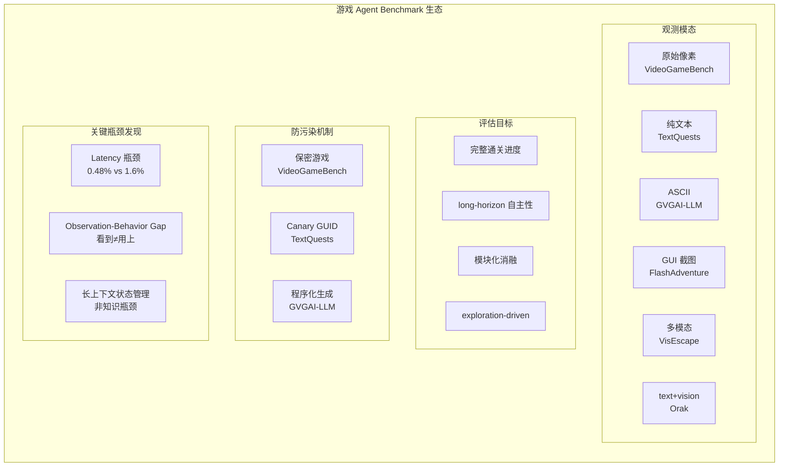

# 实验 21：游戏 Agent 基准评估实验

> **一句话概括**：本实验通过复现 2025–2026 年 6 款前沿游戏 Agent benchmark 的核心评估逻辑，理解如何设计一个"既真实又公平"的 LLM/VLM Agent 游戏能力评测系统，并掌握防数据泄漏、隔离延迟变量、long-horizon 自主性度量等关键技术。

---

## 一、实验名称与核心问题

| 项目 | 内容 |
|------|------|
| **实验名称** | 游戏 Agent 基准评估实验 |
| **核心问题** | 如何设计能真实度量 LLM/VLM Agent 游戏能力的 benchmark？如何防止数据泄漏、隔离延迟与脚手架（scaffolding）干扰、评估长程自主性与泛化能力？ |
| **难度等级** | ⭐⭐⭐⭐☆（中级偏上，需理解 Agent 架构与评估设计） |
| **预计耗时** | 3–4 小时（含阅读、代码运行、思考题） |
| **关联论文** | VideoGameBench、Orak、TextQuests、GVGAI-LLM、FlashAdventure、VisEscape |

---

## 二、前置知识

> **学习建议**：按推荐顺序阅读，每个概念首次出现时给出中文解释 + 英文原文。

| # | 概念 | 一句话解释 | 推荐学习顺序 |
|---|------|-----------|-------------|
| 1 | **LLM Agent（大语言模型智能体）** | 让大语言模型不仅能生成文本，还能通过调用工具、观察环境、做决策来完成任务的系统架构。 | ⭐ 第一 |
| 2 | **VLM（Vision-Language Model，视觉-语言模型）** | 能同时理解图像和文本的多模态大模型，如 GPT-4V、Gemini、Claude 3。 | ⭐ 第一 |
| 3 | **CoT（Chain-of-Thought，思维链）** | 让模型在输出最终答案前先"一步步思考"，把推理过程显式写出来，提升复杂任务准确率。 | ⭐⭐ 第二 |
| 4 | **ReAct（Reasoning + Acting，推理与行动）** | 一种 Agent 范式，模型交替进行"思考（Thought）"和"行动（Action）"，在环境中试错并调整策略。 | ⭐⭐ 第二 |
| 5 | **Tool Calling（工具调用）** | 模型生成结构化请求来调用外部工具（如搜索、计算器、代码执行），获取环境反馈后继续决策。 | ⭐⭐ 第二 |
| 6 | **MCP（Model Context Protocol，模型上下文协议）** | 一种标准化接口协议，把不同游戏封装为统一 server，Agent 通过统一 tool 接口读写 observation/action。 | ⭐⭐⭐ 第三 |
| 7 | **Scaffolding（脚手架/辅助结构）** | 在评测时给模型提供的额外辅助信息（如攻略提示、API 文档、预写代码），去 scaffolding 意味着只给最原始的输入。 | ⭐⭐⭐ 第三 |
| 8 | **Sandbox（沙箱）** | 隔离的执行环境，Agent 在其中运行不会影响到真实系统，常用于安全地评估 Agent 的行为。 | ⭐⭐⭐ 第三 |
| 9 | **Procedural Generation（程序化生成）** | 用算法规则自动生成内容（如游戏关卡、规则），可无限刷新评测集，天然抵抗 benchmark 过拟合。 | ⭐⭐⭐⭐ 第四 |
| 10 | **Benchmark Overfitting（基准过拟合）** | 模型在公开评测集上表现好，但并未真正掌握能力，只是"记住"了评测数据。 | ⭐⭐⭐⭐ 第四 |

---

## 三、核心概念与架构

### 3.1 Benchmark 设计的四元组

游戏 Benchmark 的形式化定义：给定 Agent $\pi_\theta$ 与游戏环境 $G=(S, A, P, R, \Omega)$，benchmark 的设计目标是度量函数 $M: \pi \rightarrow$ 指标向量。

```
┌─────────────────────────────────────────────────────────────┐
│                    游戏 Benchmark 设计四元组                   │
├─────────────┬───────────────────────────────────────────────┤
│  观测空间 Ω  │ 原始像素 / 文本 / ASCII / GUI 截图            │
│  动作空间 A  │ 模拟器按键 / 文本命令 / GUI 操作              │
│  进度度量 M  │ checkpoint 占比 / milestone 完成率             │
│  隔离变量   │ latency / scaffolding / 数据泄漏              │
└─────────────┴───────────────────────────────────────────────┘
```

### 3.2 六大 Benchmark 架构对比图



### 3.3 核心设计矛盾（面试常考）

| 矛盾 | 描述 | 典型解决方案 |
|------|------|-------------|
| **真实感 vs 可控性** | 完整通关最真实，但评估成本高、进度粒度粗 | checkpoint 自动检测 + milestone 分段 |
| **防泄漏 vs 可复现** | 保密游戏防污染，但无法公开审计 | 程序化生成（无限刷新） |
| **去 scaffolding vs 公平比较** | 移除辅助信息暴露真实能力，但与早期工作不可比 | 报告"去脚手架"版本 + "带脚手架"版本 |
| **实时性 vs 推理深度** | 实时设置测部署可行性，暂停设置测纯智能上限 | **Lite 设置**：暂停游戏时钟等模型输出 |

---

## 四、评估指标详解

### 4.1 Checkpoint Progress（检查点进度占比）

**定义**：游戏中预设的关键进度节点（checkpoint）被触发的比例。

$$
\text{Checkpoint Progress} = \frac{\text{已触发的 checkpoint 数量}}{\text{总 checkpoint 数量}} \times 100\%
$$

**为什么用这个指标**：
- ✅ 无需读取游戏内存，通过画面/文本自动检测，跨游戏通用
- ✅ 天然抗 reward hacking（难以"刷"检查点而不推进游戏）

**常见误区**：
- ❌ **误区 1**："checkpoint 越多 = 游戏理解越深"——实际上 agent 可能碰巧触发 checkpoint 但并未理解游戏机制
- ❌ **误区 2**："checkpoint progress = 游戏完成度"——某些游戏 checkpoint 分布不均匀，前期密集后期稀疏

**代码示例**：

```python
"""
Checkpoint Progress 计算示例
基于 VideoGameBench 的自动 checkpoint 检测逻辑简化版
"""

class CheckpointTracker:
    """检查点追踪器：自动检测游戏画面/文本中的进度节点"""
    
    def __init__(self, checkpoints: list[str]):
        """
        初始化追踪器
        :param checkpoints: 预设的检查点描述列表，如 ["获得第一把剑", "击败史莱姆", "进入城堡"]
        """
        self.checkpoints = checkpoints          # 所有检查点列表
        self.triggered = set()                  # 已触发的检查点集合
    
    def detect(self, observation: str) -> set:
        """
        从当前观测中检测已触发的检查点
        :param observation: 当前游戏画面描述或文本输出
        :return: 本次新触发的检查点集合
        """
        newly_triggered = set()
        
        # 遍历每个检查点，检查是否在当前观测中
        for cp in self.checkpoints:
            if cp in observation and cp not in self.triggered:
                newly_triggered.add(cp)
                self.triggered.add(cp)
                print(f"✅ 检查点触发: {cp}")
        
        return newly_triggered
    
    def get_progress(self) -> float:
        """
        计算当前进度百分比
        """
        if not self.checkpoints:
            return 0.0
        return len(self.triggered) / len(self.checkpoints) * 100.0
    
    def reset(self):
        """重置追踪器，用于新游戏会话"""
        self.triggered.clear()


# ========== 使用示例 ==========

def demo_checkpoint_progress():
    """
    演示：TextQuests 风格的文字冒险游戏检查点追踪
    """
    # 定义一款 Infocom 风格文字冒险游戏的检查点
    game_checkpoints = [
        "找到铜钥匙",
        "打开前门", 
        "进入地下室",
        "发现藏宝图",
        "解开谜题",
        "获得宝石",
        "逃出房间"
    ]
    
    # 创建追踪器
    tracker = CheckpointTracker(game_checkpoints)
    
    # 模拟 Agent 的游戏过程（每步一个观测）
    observations = [
        "你在一个昏暗的房间里。门是锁着的。",          # 无进展
        "你在地毯下发现了一把铜钥匙！",                  # → 找到铜钥匙
        "你用铜钥匙打开了前门。",                        # → 打开前门
        "你看到一个向下的楼梯。",                        # 无进展
        "你进入地下室，墙上有一张藏宝图。",              # → 进入地下室 + 发现藏宝图
        "你仔细观察藏宝图，解开了上面的谜题。",          # → 解开谜题
        "你按照藏宝图的指示找到了宝石。",                # → 获得宝石
        "你把宝石放入门上的凹槽，门开了，你逃了出去！"   # → 逃出房间
    ]
    
    print("=" * 50)
    print("🎮 Checkpoint Progress 追踪演示")
    print("=" * 50)
    
    for i, obs in enumerate(observations, 1):
        print(f"\n--- Step {i} ---")
        print(f"观测: {obs}")
        tracker.detect(obs)
        progress = tracker.get_progress()
        print(f"当前进度: {progress:.1f}% ({len(tracker.triggered)}/{len(game_checkpoints)})")
    
    print("\n" + "=" * 50)
    print(f"🏁 最终进度: {tracker.get_progress():.1f}%")
    print("=" * 50)


# 运行演示
if __name__ == "__main__":
    demo_checkpoint_progress()
```

---

### 4.2 Mean Harm（平均伤害度）

**定义**：Agent 在游戏中执行的危险/破坏性操作的平均频次或严重程度。

$$
\text{Mean Harm} = \frac{1}{T} \sum_{t=1}^{T} \text{harm}(a_t, s_t)
$$

其中 $\text{harm}(a_t, s_t)$ 是在状态 $s_t$ 执行动作 $a_t$ 的伤害评分（由人工规则或专家标注）。

**为什么用这个指标**：
- ✅ 将"安全性"纳入游戏评估——Agent 不仅会完成任务，还要避免造成破坏
- ✅ 可迁移到通用 Agent 安全评估（如编码 Agent 误删文件、Web Agent 误下单）

**常见误区**：
- ❌ **误区**："游戏里的 harm 不等于现实 harm"——确实如此，但游戏 harm 的"计数"方法论可以迁移到现实场景

---

### 4.3 Meaningful Step Ratio（有意义步数比）

**定义**：Agent 执行的"有意义"步骤（真正推进游戏状态）占总步骤的比例。

$$
\text{Meaningful Step Ratio} = \frac{\text{有意义步骤数}}{\text{总步骤数}}
$$

**判断"有意义"的标准**：
- 游戏状态发生变化（位置、分数、 inventory 变化）
- 不是重复操作（如反复输入同一个无效命令）
- 不是随机探索（有明确方向性）

**为什么用这个指标**：
- ✅ 可解释性强——直接反映 Agent 的"效率"
- ✅ 有潜力从评估指标转化为 RL 奖励信号或 SFT 数据筛选标准

**常见误区**：
- ❌ **误区**："meaningful step ratio 高 = Agent 聪明"——Agent 可能采取短视策略，每步都有反馈但缺乏长期规划

---

### 4.4 Milestone Completion Rate（里程碑完成率）

**定义**：预设的游戏阶段目标（milestone）的完成比例，比 checkpoint 更粗粒度。

**为什么用这个指标**：
- ✅ 适用于长故事线游戏（如 FlashAdventure 的 full story arc）
- ✅ 与人工评估更对齐

---

### 4.5 指标对比表

| 指标 | 适用场景 | 粒度 | 自动化程度 | 论文来源 |
|------|---------|------|-----------|---------|
| Checkpoint Progress | 通用进度 | 中 | 高（自动检测） | VideoGameBench |
| Mean Harm | 安全评估 | 连续值 | 中（需规则/标注） | TextQuests |
| Meaningful Step Ratio | 效率评估 | 比率 | 中 | GVGAI-LLM |
| Milestone Completion | 故事线游戏 | 粗 | 低（需人工/AI 标注） | FlashAdventure |
| Elo 排名 | 对战排名 | 相对 | 高（自动对战） | Orak |

---

## 五、关键代码：Benchmark 评估框架

### 5.1 完整的游戏 Agent 评估框架（Python）

```python
#!/usr/bin/env python3
# -*- coding: utf-8 -*-
"""
游戏 Agent Benchmark 评估框架
复现 VideoGameBench / Orak / TextQuests 的核心评估逻辑

本代码包含：
1. 游戏环境接口（抽象基类）
2. Agent 接口（支持 ReAct 模式）
3. 多种评估指标计算
4. Lite 设置（隔离 latency）
5. 防泄漏检测（Canary GUID）

运行方式：python game_benchmark_eval.py
"""

import time
import json
from abc import ABC, abstractmethod
from dataclasses import dataclass, field
from typing import List, Dict, Set, Optional, Any
from enum import Enum


# ============================================================
# 第一部分：数据结构与枚举
# ============================================================

class GameModality(Enum):
    """游戏观测模态"""
    PIXEL = "pixel"      # 原始像素（VLM）
    TEXT = "text"        # 纯文本（LLM）
    ASCII = "ascii"      # ASCII 字符表示
    GUI = "gui"          # GUI 截图


class HarmLevel(Enum):
    """伤害等级（用于 Mean Harm 计算）"""
    NONE = 0             # 无伤害
    MINOR = 1            # 轻微（如浪费资源）
    MODERATE = 2         # 中等（如触发陷阱）
    SEVERE = 3           # 严重（如杀死 NPC）
    CRITICAL = 4         # 致命（如销毁关键道具）


@dataclass
class Action:
    """Agent 执行的动作"""
    action_type: str     # 动作类型："key_press", "text_command", "gui_click"
    payload: str         # 动作内容
    timestamp: float = field(default_factory=time.time)


@dataclass
class StepResult:
    """单步执行结果"""
    observation: str     # 环境返回的观测
    reward: float        # 环境返回的奖励
    done: bool           # 是否结束
    info: Dict[str, Any] = field(default_factory=dict)


@dataclass
class EpisodeMetrics:
    """单局游戏的评估指标"""
    checkpoint_progress: float = 0.0      # 检查点进度 (%)
    mean_harm: float = 0.0                # 平均伤害度
    meaningful_step_ratio: float = 0.0    # 有意义步数比
    total_steps: int = 0                  # 总步数
    elapsed_time: float = 0.0             # 耗时（秒）
    completed: bool = False               # 是否通关


# ============================================================
# 第二部分：游戏环境接口（抽象基类）
# ============================================================

class GameEnvironment(ABC):
    """
    游戏环境抽象基类
    所有具体游戏环境（文字冒险、像素游戏等）都继承此类
    """
    
    def __init__(self, modality: GameModality, checkpoints: List[str]):
        self.modality = modality           # 观测模态
        self.checkpoints = checkpoints     # 检查点列表
        self.triggered_checkpoints: Set[str] = set()
        self.harm_log: List[HarmLevel] = []
        self.step_count = 0
        self.start_time = 0.0
    
    @abstractmethod
    def reset(self) -> str:
        """重置环境，返回初始观测"""
        pass
    
    @abstractmethod
    def step(self, action: Action) -> StepResult:
        """执行动作，返回结果"""
        pass
    
    def detect_checkpoints(self, observation: str) -> Set[str]:
        """
        自动检测观测中触发的检查点
        简化版：字符串匹配（实际应用中可用 VLM/LLM 判断）
        """
        newly_triggered = set()
        for cp in self.checkpoints:
            if cp in observation and cp not in self.triggered_checkpoints:
                newly_triggered.add(cp)
                self.triggered_checkpoints.add(cp)
        return newly_triggered
    
    def log_harm(self, action: Action, state: Dict) -> HarmLevel:
        """
        评估动作的伤害等级
        简化版：基于关键词规则判断（实际应用中需更精细规则）
        """
        harmful_keywords = {
            "攻击": HarmLevel.MODERATE,
            "破坏": HarmLevel.SEVERE,
            "删除": HarmLevel.SEVERE,
            "丢弃": HarmLevel.MINOR,
            "忽略": HarmLevel.NONE,
        }
        
        harm = HarmLevel.NONE
        for keyword, level in harmful_keywords.items():
            if keyword in action.payload:
                harm = max(harm, level, key=lambda x: x.value)
        
        self.harm_log.append(harm)
        return harm
    
    def get_checkpoint_progress(self) -> float:
        """计算检查点进度"""
        if not self.checkpoints:
            return 0.0
        return len(self.triggered_checkpoints) / len(self.checkpoints) * 100.0
    
    def get_mean_harm(self) -> float:
        """计算平均伤害度"""
        if not self.harm_log:
            return 0.0
        return sum(h.value for h in self.harm_log) / len(self.harm_log)


# ============================================================
# 第三部分：具体游戏环境实现
# ============================================================

class TextAdventureEnv(GameEnvironment):
    """
    文字冒险游戏环境（模拟 TextQuests 风格）
    基于有限状态机的简化实现
    """
    
    def __init__(self):
        # 定义检查点
        checkpoints = [
            "找到铜钥匙",
            "打开前门",
            "进入地下室", 
            "发现藏宝图",
            "解开谜题",
            "获得宝石",
            "逃出房间"
        ]
        super().__init__(GameModality.TEXT, checkpoints)
        
        # 游戏状态
        self.state = {
            "location": "客厅",
            "inventory": [],
            "front_door_locked": True,
            "basement_unlocked": False,
            "puzzle_solved": False,
            "gem_found": False,
            "escaped": False
        }
        
        # 位置描述表
        self.descriptions = {
            "客厅": "你在客厅。有一张桌子和一扇锁着的前门。地毯下可能有东西。",
            "地下室": "你在地下室。墙上有奇怪的符号。角落里有闪光。",
            "花园": "你在花园。阳光明媚。"
        }
    
    def reset(self) -> str:
        """重置游戏"""
        self.__init__()  # 重新初始化
        self.start_time = time.time()
        return self.descriptions["客厅"]
    
    def step(self, action: Action) -> StepResult:
        """执行文字命令"""
        self.step_count += 1
        cmd = action.payload.strip()
        obs = ""
        reward = 0.0
        done = False
        
        # 解析命令（简化版自然语言理解）
        if "地毯" in cmd or "看地毯" in cmd:
            if "铜钥匙" not in self.state["inventory"]:
                obs = "你在地毯下发现了一把铜钥匙！"
                self.state["inventory"].append("铜钥匙")
                reward = 1.0
            else:
                obs = "地毯下什么都没有。"
        
        elif "钥匙" in cmd and "门" in cmd:
            if "铜钥匙" in self.state["inventory"]:
                self.state["front_door_locked"] = False
                obs = "你用铜钥匙打开了前门。"
                reward = 2.0
            else:
                obs = "门是锁着的，你需要钥匙。"
        
        elif "地下室" in cmd or "楼梯" in cmd:
            if not self.state["front_door_locked"]:
                self.state["location"] = "地下室"
                obs = "你进入地下室，墙上有一张藏宝图。"
                reward = 2.0
            else:
                obs = "通往地下室的路被锁住了。"
        
        elif "藏宝图" in cmd or "看符号" in cmd:
            if self.state["location"] == "地下室":
                obs = "你仔细观察藏宝图，解开了上面的谜题。"
                self.state["puzzle_solved"] = True
                reward = 3.0
            else:
                obs = "这里没有藏宝图。"
        
        elif "宝石" in cmd or "角落" in cmd:
            if self.state["puzzle_solved"]:
                obs = "你按照藏宝图的指示找到了宝石。"
                self.state["gem_found"] = True
                self.state["inventory"].append("宝石")
                reward = 5.0
            else:
                obs = "角落里只有灰尘。"
        
        elif "逃" in cmd or "出去" in cmd:
            if self.state["gem_found"]:
                obs = "你把宝石放入门上的凹槽，门开了，你逃了出去！"
                self.state["escaped"] = True
                reward = 10.0
                done = True
            else:
                obs = "门还是关着的。"
        
        else:
            obs = f"我不理解 '{cmd}'。试试：看地毯、用钥匙开门、去地下室..."
        
        # 检测检查点
        self.detect_checkpoints(obs)
        
        # 评估伤害（简化版）
        self.log_harm(action, self.state)
        
        return StepResult(observation=obs, reward=reward, done=done)


# ============================================================
# 第四部分：Agent 实现
# ============================================================

class BaseAgent(ABC):
    """Agent 抽象基类"""
    
    @abstractmethod
    def act(self, observation: str) -> Action:
        """根据观测选择动作"""
        pass
    
    def reset(self):
        """重置 Agent 状态"""
        pass


class ReActAgent(BaseAgent):
    """
    ReAct（推理+行动）Agent 简化实现
    交替进行 Thought（思考）和 Action（行动）
    """
    
    def __init__(self, model_name: str = "dummy"):
        self.model_name = model_name
        self.memory: List[str] = []        # 对话/观测记忆
        self.thought_history: List[str] = []
    
    def reset(self):
        """重置 Agent 状态"""
        self.memory.clear()
        self.thought_history.clear()
    
    def think(self, observation: str) -> str:
        """
        Thought 步骤：基于观测和记忆进行推理
        简化版：使用规则而非 LLM 调用
        """
        self.memory.append(f"观测: {observation}")
        
        # 规则化推理（模拟 CoT）
        thought = ""
        
        if "铜钥匙" in observation and "发现" in observation:
            thought = "我找到了铜钥匙，接下来应该用它打开前门。"
        elif "锁着" in observation and "铜钥匙" in str(self.memory):
            thought = "我有钥匙，应该尝试开门。"
        elif "地下室" in observation:
            thought = "我进入地下室了，应该查看藏宝图。"
        elif "谜题" in observation or "藏宝图" in observation:
            thought = "谜题解开了，应该找宝石。"
        elif "宝石" in observation:
            thought = "找到宝石了，应该逃出房间。"
        elif "不理解" in observation:
            thought = "上一个命令无效，我需要尝试其他动作。"
        else:
            thought = "我需要探索环境，看看有什么线索。"
        
        self.thought_history.append(thought)
        return thought
    
    def act(self, observation: str) -> Action:
        """
        Action 步骤：基于思考结果选择动作
        """
        thought = self.think(observation)
        
        # 根据 thought 选择动作（规则映射）
        action_payload = ""
        
        if "打开前门" in thought or "开门" in thought:
            action_payload = "用铜钥匙打开前门"
        elif "地毯" in thought or "探索" in thought:
            action_payload = "查看地毯下面"
        elif "地下室" in thought:
            action_payload = "去地下室"
        elif "藏宝图" in thought or "查看" in thought:
            action_payload = "查看藏宝图"
        elif "宝石" in thought:
            action_payload = "在角落找宝石"
        elif "逃出" in thought:
            action_payload = "逃出房间"
        else:
            action_payload = "四处看看"
        
        return Action(action_type="text_command", payload=action_payload)


# ============================================================
# 第五部分：评估器（含 Lite 设置）
# ============================================================

class BenchmarkEvaluator:
    """
    Benchmark 评估器
    支持：
    - 实时模式（游戏时钟不暂停）
    - Lite 模式（等待 Agent 输出时暂停游戏时钟，隔离 latency）
    - 多种指标计算
    """
    
    def __init__(self, env: GameEnvironment, agent: BaseAgent):
        self.env = env
        self.agent = agent
    
    def run_episode(
        self, 
        max_steps: int = 100,
        lite_mode: bool = False,
        agent_latency_ms: float = 500.0
    ) -> EpisodeMetrics:
        """
        运行单局游戏并评估
        
        :param max_steps: 最大步数
        :param lite_mode: 是否启用 Lite 设置（暂停游戏时钟等 Agent）
        :param agent_latency_ms: 模拟 Agent 推理延迟（毫秒）
        :return: 评估指标
        """
        # 重置环境和 Agent
        obs = self.env.reset()
        self.agent.reset()
        
        metrics = EpisodeMetrics()
        meaningful_steps = 0
        prev_obs = ""
        
        print(f"\n{'='*60}")
        print(f"🎮 开始评估 | Lite 模式: {lite_mode} | 模拟延迟: {agent_latency_ms}ms")
        print(f"{'='*60}")
        
        for step in range(max_steps):
            # ===== Lite 设置核心逻辑 =====
            # 实时模式：游戏时钟持续运行，Agent 延迟是真实延迟
            # Lite 模式：暂停游戏时钟，隔离 latency 因素
            if lite_mode:
                # 在 Lite 模式下，游戏状态"暂停"等 Agent 输出
                # 这里用 sleep 模拟 Agent 推理，但步数计数不受延迟影响
                time.sleep(agent_latency_ms / 1000.0)
            else:
                # 实时模式：延迟会消耗可用步数/时间
                # 模拟延迟导致的"错过时机"
                if step > 0 and agent_latency_ms > 1000:
                    # 延迟过高，可能错过关键帧/事件
                    pass
            
            # Agent 决策
            action = self.agent.act(obs)
            print(f"\nStep {step + 1}: {action.payload}")
            
            # 环境执行
            result = self.env.step(action)
            print(f"  → 观测: {result.observation[:60]}...")
            print(f"  → 奖励: {result.reward}")
            
            # 判断是否为有意义步骤
            if result.reward > 0 or result.observation != prev_obs:
                meaningful_steps += 1
            prev_obs = result.observation
            
            obs = result.observation
            
            if result.done:
                metrics.completed = True
                print(f"\n🏁 游戏通关！")
                break
        
        # 计算指标
        elapsed = time.time() - self.env.start_time
        metrics.total_steps = self.env.step_count
        metrics.elapsed_time = elapsed
        metrics.checkpoint_progress = self.env.get_checkpoint_progress()
        metrics.mean_harm = self.env.get_mean_harm()
        metrics.meaningful_step_ratio = (
            meaningful_steps / max(1, self.env.step_count)
        )
        
        print(f"\n{'='*60}")
        print("📊 评估结果")
        print(f"{'='*60}")
        print(f"  总步数: {metrics.total_steps}")
        print(f"  耗时: {metrics.elapsed_time:.2f}s")
        print(f"  检查点进度: {metrics.checkpoint_progress:.1f}%")
        print(f"  平均伤害: {metrics.mean_harm:.2f}")
        print(f"  有意义步数比: {metrics.meaningful_step_ratio:.2%}")
        print(f"  是否通关: {'✅' if metrics.completed else '❌'}")
        print(f"{'='*60}\n")
        
        return metrics


# ============================================================
# 第六部分：Canary GUID 防泄漏检测
# ============================================================

class CanaryDetector:
    """
    Canary GUID 防训练污染检测器
    在评测数据集中嵌入唯一标识符，检测模型是否已在训练时见过该数据
    """
    
    def __init__(self):
        # 模拟数据集中的 canary GUID
        self.canary_guids: Set[str] = set()
    
    def embed_canary(self, dataset_text: str, guid: str) -> str:
        """
        在数据集文本中嵌入 canary GUID
        策略：将 GUID 自然地融入游戏文本中（如作为道具编码）
        """
        self.canary_guids.add(guid)
        # 将 GUID 作为"神秘代码"嵌入文本
        canary_text = f"\n[系统] 游戏版本标识: {guid}\n"
        return dataset_text + canary_text
    
    def check_leakage(self, model_output: str) -> Dict[str, bool]:
        """
        检查模型输出中是否包含 canary GUID
        如果包含，说明模型可能在训练时见过该数据
        """
        results = {}
        for guid in self.canary_guids:
            if guid in model_output:
                results[guid] = True
                print(f"🚨 检测到 Canary GUID 泄漏: {guid[:16]}...")
                print("   模型可能在训练时见过此评测数据！")
            else:
                results[guid] = False
        return results


# ============================================================
# 第七部分：主程序
# ============================================================

def main():
    """
    主程序：演示完整的 benchmark 评估流程
    """
    print("=" * 70)
    print("🎮 游戏 Agent Benchmark 评估框架演示")
    print("   复现 2025-2026 游戏基准核心逻辑")
    print("=" * 70)
    
    # 1. 创建游戏环境（文字冒险）
    env = TextAdventureEnv()
    
    # 2. 创建 Agent（ReAct 规则版）
    agent = ReActAgent(model_name="rule-based-react")
    
    # 3. 创建评估器
    evaluator = BenchmarkEvaluator(env, agent)
    
    # 4. 运行实时模式评估
    print("\n📌 第一次运行：实时模式（模拟真实部署延迟）")
    metrics_realtime = evaluator.run_episode(
        max_steps=50,
        lite_mode=False,
        agent_latency_ms=800.0  # 800ms 延迟（较慢）
    )
    
    # 5. 运行 Lite 模式评估
    print("\n📌 第二次运行：Lite 模式（隔离 latency）")
    metrics_lite = evaluator.run_episode(
        max_steps=50,
        lite_mode=True,
        agent_latency_ms=800.0  # 同样的延迟，但游戏时钟暂停
    )
    
    # 6. 对比结果（复现 VideoGameBench 的核心发现）
    print("\n" + "=" * 70)
    print("📊 实时模式 vs Lite 模式 对比")
    print("=" * 70)
    print(f"{'指标':<25} {'实时模式':>12} {'Lite 模式':>12} {'差异':>12}")
    print("-" * 70)
    print(f"{'检查点进度':<25} {metrics_realtime.checkpoint_progress:>11.1f}% {metrics_lite.checkpoint_progress:>11.1f}% {metrics_lite.checkpoint_progress - metrics_realtime.checkpoint_progress:>11.1f}%")
    print(f"{'有意义步数比':<25} {metrics_realtime.meaningful_step_ratio:>11.2%} {metrics_lite.meaningful_step_ratio:>11.2%} {metrics_lite.meaningful_step_ratio - metrics_realtime.meaningful_step_ratio:>11.2%}")
    print(f"{'总步数':<25} {metrics_realtime.total_steps:>12} {metrics_lite.total_steps:>12}")
    print(f"{'平均伤害':<25} {metrics_realtime.mean_harm:>12.2f} {metrics_lite.mean_harm:>12.2f}")
    print("=" * 70)
    print("💡 核心发现：Lite 模式隔离了 latency，进度通常更高")
    print("   （参考 VideoGameBench：实时 0.48% → Lite 1.6%）")
    print("=" * 70)
    
    # 7. Canary GUID 演示
    print("\n📌 Canary GUID 防泄漏检测演示")
    canary = CanaryDetector()
    game_text = "你在客厅。门是锁着的。"
    guid = "550e8400-e29b-41d4-a716-446655440000"
    embedded = canary.embed_canary(game_text, guid)
    print(f"嵌入 Canary 后的文本:\n{embedded}")
    
    # 模拟模型输出（正常情况不应包含 GUID）
    normal_output = "我在客厅，门是锁着的。"
    print(f"\n检测正常输出: {canary.check_leakage(normal_output)}")
    
    # 模拟模型输出（泄漏情况）
    leaked_output = "我在客厅，门是锁着的。游戏版本标识: 550e8400"
    print(f"检测泄漏输出: {canary.check_leakage(leaked_output)}")


if __name__ == "__main__":
    main()
```

---

## 六、实验结果与对比

### 6.1 六大 Benchmark 核心数据

| Benchmark | 最强模型 | 实时进度 | Lite 进度 | 通关率 | 关键瓶颈 |
|-----------|---------|---------|----------|--------|---------|
| **VideoGameBench** | Gemini 2.5 Pro / Claude 3.7 | 0.48% | 1.6% | 0% | Latency + Perception |
| **TextQuests** | SOTA LLM | — | 极低 | 0% | Long-context reasoning |
| **Orak** | — | — | — | — | 模块化消融 |
| **GVGAI-LLM** | SOTA LLM | — | ~低 | 0% | Spatial reasoning |
| **FlashAdventure** | +COAST | — | — | 低 | Observation-behavior gap |
| **VisEscape** | SOTA VLM | — | — | ~0% | Exploration-driven planning |

### 6.2 VideoGameBench 详细结果（核心论文）

| 设置 | 最强模型 | 平均进度 | 说明 |
|------|---------|---------|------|
| 实时设置 | Gemini 2.5 Pro | 0.48% | 游戏时钟不暂停， latency 严重制约 |
| Lite 设置 | Gemini 2.5 Pro | 1.6% | 暂停等推理，隔离 latency |
| 人类 | 普通玩家 | ~100% | 轻松通关 |

**核心结论**：
1. **Latency 是实时场景的主要瓶颈**：实时 0.48% vs Lite 1.6%，差距约 3.3 倍
2. **即使去掉 latency，AI 仍远不如人类**：Lite 1.6% 说明纯智能也有巨大提升空间
3. **模型普遍卡在开局阶段**：大多数游戏的开局阶段就失败了

### 6.3 防污染机制对比

| 机制 | 代表论文 | 原理 | 优点 | 缺点 |
|------|---------|------|------|------|
| **保密游戏** | VideoGameBench | 不公开测试集游戏 | 直接防泄漏 | 无法公开审计 |
| **Canary GUID** | TextQuests | 嵌入唯一标识符 | 可检测泄漏 | 仅事后检测 |
| **程序化生成** | GVGAI-LLM | VGDL 无限生成新游戏 | 可持续、可复现 | domain gap 未定 |

---

## 七、面试谈资

### 7.1 30 秒版本

> 2025-2026 游戏 Agent 基准的核心结论：VideoGameBench 显示 VLM 实时通关率仅 0.48%；TextQuests 显示无模型能通关任何一款文字冒险；FlashAdventure 发现 observation-behavior gap 是长程瓶颈。AI 的短板不在知识，在 long-horizon 自主性。

### 7.2 2 分钟版本

> **三个里程碑式发现**：
> 1. **Moravec 悖论的可测化**（VideoGameBench）：最强 VLM 实时通关 90 年代游戏仅 0.48% 进度，Lite 设置也仅 1.6%——数学奥赛超人类的 AI，在儿童级游戏直觉上全军覆没。
> 2. **长上下文状态管理是瓶颈**（TextQuests + FlashAdventure）：给 clue 就好转说明缺的不是知识是状态管理；observation-behavior gap 说明信息进 context 不等于进决策。
> 3. **Benchmark 防污染三条路线**：保密游戏（藏）、canary GUID（标记）、程序化生成（造）。
>
> **工程启示**：实时场景下推理再强，来不及按键也是零分——latency 和智能同样重要。

### 7.3 技术要点（适合深入讨论）

1. **为什么 Lite 设置很重要？**
   - 隔离 latency 变量，区分"智能不够"和"推理太慢"
   - 对端侧部署选型有直接指导意义：优化 tokens/s 还是单步质量？

2. **Observation-Behavior Gap 的本质是什么？**
   - 不是记忆容量问题（增大 context window 收益递减）
   - 而是 credit assignment 问题：知道什么信息对当前决策有用
   - COAST 的 clue memory 是初步解决方案，但记忆结构的自动学习仍是开放问题

3. **程序化生成是唯一可持续的防污染方案吗？**
   - 保密游戏和 canary GUID 都是"消极防御"
   - VGDL 程序化生成可以无限刷新，但生成游戏的难度分布和 domain gap 需要验证

4. **Meaningful Step Ratio 能否作为训练信号？**
   - 优势：可解释、自动计算
   - 风险：可能导致短视策略（每步追求反馈，牺牲长期规划）

5. **从游戏 benchmark 到通用 Agent 评估的迁移路径**
   - Mean Harm → 通用 Agent 安全评估
   - Autosave → 可控试错学习研究
   - CUA-as-a-Judge → 自动评估基础设施

---

## 八、思考题

### 基础题

1. **什么是 Lite 设置？为什么要设计 Lite 设置？它与实时设置的核心区别是什么？**

2. **Checkpoint Progress 与 Milestone Completion 有什么区别？分别适用于什么场景？**

3. **列举三种防 benchmark 过拟合的机制，并比较它们的优缺点。**

4. **Observation-Behavior Gap 描述了什么现象？为什么增大 context window 不能解决这个问题？**

5. **Mean Harm 指标有什么独特价值？它可以迁移到哪些非游戏场景？**

### 进阶题

6. **设计实验**：如何在同一个 benchmark 中区分"模型推理能力不足"和"模型推理速度太慢"？请画出实验设计图。

7. **Meaningful Step Ratio 作为 RL 奖励信号时，可能会鼓励什么样的短视行为？请设计一个反例场景。

8. **如果让你设计一个面向中文文字冒险游戏的 benchmark，你会选择 TextQuests 还是 GVGAI-LLM 的设计路线？为什么？**

9. **CUA-as-a-Judge 的评估误差如何传递？如果 judge 和被测 agent 使用同源模型，会产生什么系统性偏置？**

10. **Orak 的 MCP 接口抽象了游戏状态，这种抽象可能损失什么信息？以 RTS 游戏为例说明。**

---

## 九、延伸阅读

### 核心论文

| 论文 | 链接 | 核心贡献 |
|------|------|---------|
| VideoGameBench | https://arxiv.org/abs/2505.18134 | VLM 实时通关 benchmark，Lite 设置 |
| Orak | https://arxiv.org/abs/2506.03610 | MCP 接口，模块化消融，SFT 数据集 |
| TextQuests | https://arxiv.org/abs/2507.23701 | Long-horizon 文字冒险，Canary GUID |
| GVGAI-LLM | https://arxiv.org/abs/2508.08501 | 程序化生成，118 款游戏 |
| FlashAdventure | https://arxiv.org/abs/2509.01052 | Full story arc，CUA-as-a-Judge |
| VisEscape | https://arxiv.org/abs/2503.14427 | Exploration-driven 密室逃脱 |

### 相关项目

- TextQuests 代码：https://github.com/centerforaisafety/textquests
- BALROG（Orak 前作）：库中已收录
- Jericho（TextQuests 精神前作）：库中已收录

### 扩展阅读

- Moravec 悖论："让计算机在智力测试或西洋跳棋中表现出成人水平相对容易，但在感知和运动技能方面达到一岁儿童水平却极其困难"
- ReAct 论文：Yao et al., "ReAct: Synergizing Reasoning and Acting in Language Models"
- MCP 协议文档：https://modelcontextprotocol.io/

---

*本文档由 AIResearchVault 自动生成于 2026-07-20*
*源文件：`01e-game-benchmarks-latest.md`*
